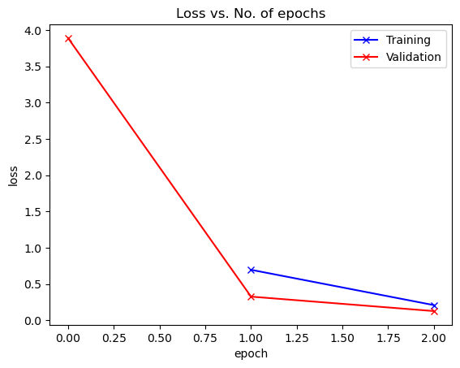
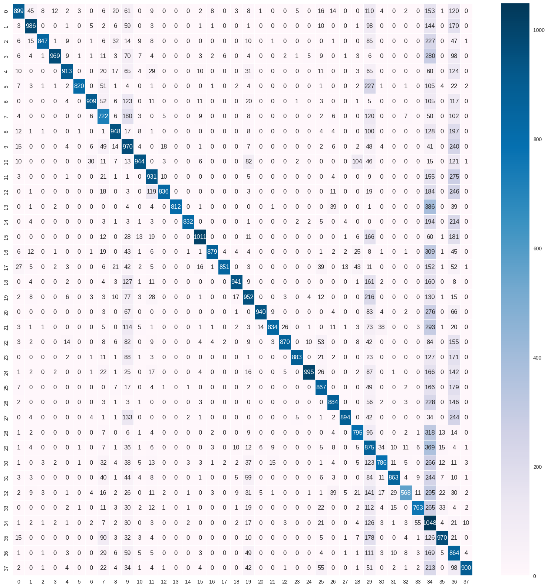
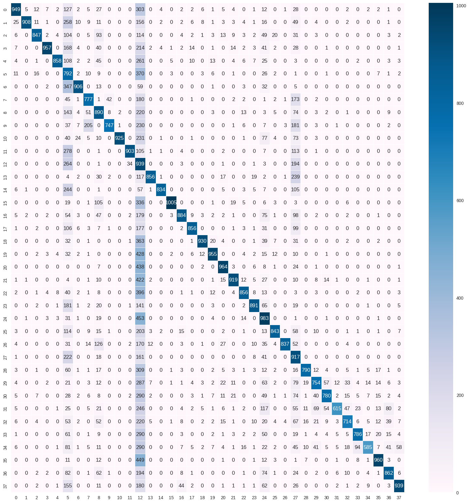
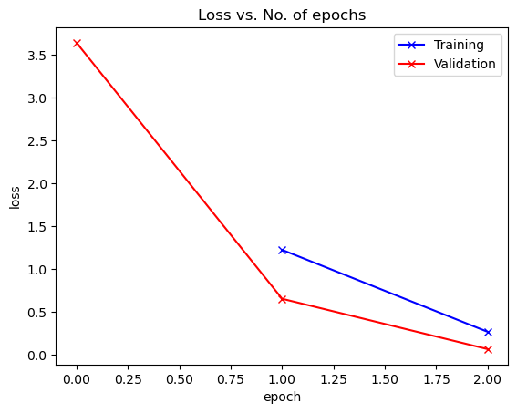
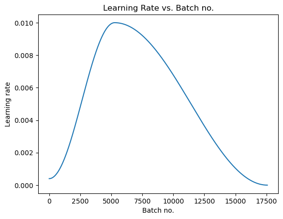

## PRE-TRAINED WITH IMAGE NET

### RESNET 18

----------------------------------------------------------------
        Layer (type)               Output Shape         Param #
================================================================
            Conv2d-1         [-1, 64, 128, 128]           9,408
       BatchNorm2d-2         [-1, 64, 128, 128]             128
              ReLU-3         [-1, 64, 128, 128]               0
         MaxPool2d-4           [-1, 64, 64, 64]               0
            Conv2d-5           [-1, 64, 64, 64]          36,864
       BatchNorm2d-6           [-1, 64, 64, 64]             128
              ReLU-7           [-1, 64, 64, 64]               0
            Conv2d-8           [-1, 64, 64, 64]          36,864
       BatchNorm2d-9           [-1, 64, 64, 64]             128
             ReLU-10           [-1, 64, 64, 64]               0
       BasicBlock-11           [-1, 64, 64, 64]               0
           Conv2d-12           [-1, 64, 64, 64]          36,864
      BatchNorm2d-13           [-1, 64, 64, 64]             128
             ReLU-14           [-1, 64, 64, 64]               0
           Conv2d-15           [-1, 64, 64, 64]          36,864
      BatchNorm2d-16           [-1, 64, 64, 64]             128
             ReLU-17           [-1, 64, 64, 64]               0
       BasicBlock-18           [-1, 64, 64, 64]               0
           Conv2d-19          [-1, 128, 32, 32]          73,728
      BatchNorm2d-20          [-1, 128, 32, 32]             256
             ReLU-21          [-1, 128, 32, 32]               0
           Conv2d-22          [-1, 128, 32, 32]         147,456
      BatchNorm2d-23          [-1, 128, 32, 32]             256
           Conv2d-24          [-1, 128, 32, 32]           8,192
      BatchNorm2d-25          [-1, 128, 32, 32]             256
             ReLU-26          [-1, 128, 32, 32]               0
       BasicBlock-27          [-1, 128, 32, 32]               0
           Conv2d-28          [-1, 128, 32, 32]         147,456
      BatchNorm2d-29          [-1, 128, 32, 32]             256
             ReLU-30          [-1, 128, 32, 32]               0
           Conv2d-31          [-1, 128, 32, 32]         147,456
      BatchNorm2d-32          [-1, 128, 32, 32]             256
             ReLU-33          [-1, 128, 32, 32]               0
       BasicBlock-34          [-1, 128, 32, 32]               0
           Conv2d-35          [-1, 256, 16, 16]         294,912
      BatchNorm2d-36          [-1, 256, 16, 16]             512
             ReLU-37          [-1, 256, 16, 16]               0
           Conv2d-38          [-1, 256, 16, 16]         589,824
      BatchNorm2d-39          [-1, 256, 16, 16]             512
           Conv2d-40          [-1, 256, 16, 16]          32,768
      BatchNorm2d-41          [-1, 256, 16, 16]             512
             ReLU-42          [-1, 256, 16, 16]               0
       BasicBlock-43          [-1, 256, 16, 16]               0
           Conv2d-44          [-1, 256, 16, 16]         589,824
      BatchNorm2d-45          [-1, 256, 16, 16]             512
             ReLU-46          [-1, 256, 16, 16]               0
           Conv2d-47          [-1, 256, 16, 16]         589,824
      BatchNorm2d-48          [-1, 256, 16, 16]             512
             ReLU-49          [-1, 256, 16, 16]               0
       BasicBlock-50          [-1, 256, 16, 16]               0
           Conv2d-51            [-1, 512, 8, 8]       1,179,648
      BatchNorm2d-52            [-1, 512, 8, 8]           1,024
             ReLU-53            [-1, 512, 8, 8]               0
           Conv2d-54            [-1, 512, 8, 8]       2,359,296
      BatchNorm2d-55            [-1, 512, 8, 8]           1,024
           Conv2d-56            [-1, 512, 8, 8]         131,072
      BatchNorm2d-57            [-1, 512, 8, 8]           1,024
             ReLU-58            [-1, 512, 8, 8]               0
       BasicBlock-59            [-1, 512, 8, 8]               0
           Conv2d-60            [-1, 512, 8, 8]       2,359,296
      BatchNorm2d-61            [-1, 512, 8, 8]           1,024
             ReLU-62            [-1, 512, 8, 8]               0
           Conv2d-63            [-1, 512, 8, 8]       2,359,296
      BatchNorm2d-64            [-1, 512, 8, 8]           1,024
             ReLU-65            [-1, 512, 8, 8]               0
       BasicBlock-66            [-1, 512, 8, 8]               0
AdaptiveAvgPool2d-67            [-1, 512, 1, 1]               0
           Linear-68                   [-1, 38]          19,494
================================================================
Total params: 11,196,006
Trainable params: 19,494
Non-trainable params: 11,176,512
----------------------------------------------------------------
Input size (MB): 0.75
Forward/backward pass size (MB): 82.00
Params size (MB): 42.71
Estimated Total Size (MB): 125.46
----------------------------------------------------------------
None

Epoch [0], last_lr: 0.00812, train_loss: 0.6971, val_loss: 0.3277, val_acc: 0.9219
Epoch [1], last_lr: 0.00000, train_loss: 0.2106, val_loss: 0.1286, val_acc: 0.9623
CPU times: user 1min 59s, sys: 2min 13s, total: 4min 12s
Wall time: 3min 19s

Classification Report: 

                                                    precision    recall  f1-score   support

                                Apple___Apple_scab       0.85      0.59      0.70      1512
                                 Apple___Black_rot       0.88      0.66      0.76      1491
                          Apple___Cedar_apple_rust       0.98      0.64      0.77      1320
                                   Apple___healthy       0.97      0.64      0.78      1506
                               Blueberry___healthy       0.93      0.67      0.78      1362
          Cherry_(including_sour)___Powdery_mildew       0.99      0.65      0.78      1263
                 Cherry_(including_sour)___healthy       0.93      0.66      0.78      1368
Corn_(maize)___Cercospora_leaf_spot Gray_leaf_spot       0.54      0.59      0.56      1230
                       Corn_(maize)___Common_rust_       0.83      0.66      0.74      1431
               Corn_(maize)___Northern_Leaf_Blight       0.35      0.68      0.46      1431
                            Corn_(maize)___healthy       0.92      0.68      0.78      1395
                                 Grape___Black_rot       0.72      0.66      0.69      1416
                      Grape___Esca_(Black_Measles)       0.95      0.58      0.72      1440
        Grape___Leaf_blight_(Isariopsis_Leaf_Spot)       1.00      0.63      0.77      1290
                                   Grape___healthy       0.99      0.66      0.79      1269
          Orange___Haunglongbing_(Citrus_greening)       0.92      0.67      0.78      1509
                            Peach___Bacterial_spot       0.97      0.64      0.77      1377
                                   Peach___healthy       0.98      0.66      0.79      1296
                     Pepper,_bell___Bacterial_spot       0.94      0.66      0.77      1434
                            Pepper,_bell___healthy       0.64      0.64      0.64      1491
                             Potato___Early_blight       0.97      0.65      0.78      1455
                              Potato___Late_blight       0.96      0.57      0.72      1455
                                  Potato___healthy       0.96      0.64      0.76      1368
                               Raspberry___healthy       0.98      0.66      0.79      1335
                                 Soybean___healthy       0.98      0.66      0.79      1515
                           Squash___Powdery_mildew       0.72      0.67      0.69      1302
                          Strawberry___Leaf_scorch       0.84      0.66      0.74      1332
                              Strawberry___healthy       0.97      0.65      0.78      1368
                           Tomato___Bacterial_spot       0.76      0.62      0.69      1275
                             Tomato___Early_blight       0.23      0.61      0.33      1440
                              Tomato___Late_blight       0.86      0.57      0.68      1389
                                Tomato___Leaf_Mold       0.92      0.61      0.73      1410
                       Tomato___Septoria_leaf_spot       0.91      0.43      0.59      1308
     Tomato___Spider_mites Two-spotted_spider_mite       0.89      0.58      0.71      1305
                              Tomato___Target_Spot       0.14      0.76      0.23      1371
            Tomato___Tomato_Yellow_Leaf_Curl_Virus       0.89      0.66      0.76      1470
                      Tomato___Tomato_mosaic_virus       0.19      0.64      0.29      1344
                                  Tomato___healthy       0.97      0.62      0.76      1443

                                          accuracy                           0.64     52716
                                         macro avg       0.83      0.64      0.70     52716
                                      weighted avg       0.83      0.64      0.70     52716

Balanced accuracy score: 
0.6365043220007963

### RESNET 34

----------------------------------------------------------------
        Layer (type)               Output Shape         Param #
================================================================
            Conv2d-1         [-1, 64, 128, 128]           9,408
       BatchNorm2d-2         [-1, 64, 128, 128]             128
              ReLU-3         [-1, 64, 128, 128]               0
         MaxPool2d-4           [-1, 64, 64, 64]               0
            Conv2d-5           [-1, 64, 64, 64]          36,864
       BatchNorm2d-6           [-1, 64, 64, 64]             128
              ReLU-7           [-1, 64, 64, 64]               0
            Conv2d-8           [-1, 64, 64, 64]          36,864
       BatchNorm2d-9           [-1, 64, 64, 64]             128
             ReLU-10           [-1, 64, 64, 64]               0
       BasicBlock-11           [-1, 64, 64, 64]               0
           Conv2d-12           [-1, 64, 64, 64]          36,864
      BatchNorm2d-13           [-1, 64, 64, 64]             128
             ReLU-14           [-1, 64, 64, 64]               0
           Conv2d-15           [-1, 64, 64, 64]          36,864
      BatchNorm2d-16           [-1, 64, 64, 64]             128
             ReLU-17           [-1, 64, 64, 64]               0
       BasicBlock-18           [-1, 64, 64, 64]               0
           Conv2d-19           [-1, 64, 64, 64]          36,864
      BatchNorm2d-20           [-1, 64, 64, 64]             128
             ReLU-21           [-1, 64, 64, 64]               0
           Conv2d-22           [-1, 64, 64, 64]          36,864
      BatchNorm2d-23           [-1, 64, 64, 64]             128
             ReLU-24           [-1, 64, 64, 64]               0
       BasicBlock-25           [-1, 64, 64, 64]               0
           Conv2d-26          [-1, 128, 32, 32]          73,728
      BatchNorm2d-27          [-1, 128, 32, 32]             256
             ReLU-28          [-1, 128, 32, 32]               0
           Conv2d-29          [-1, 128, 32, 32]         147,456
      BatchNorm2d-30          [-1, 128, 32, 32]             256
           Conv2d-31          [-1, 128, 32, 32]           8,192
      BatchNorm2d-32          [-1, 128, 32, 32]             256
             ReLU-33          [-1, 128, 32, 32]               0
       BasicBlock-34          [-1, 128, 32, 32]               0
           Conv2d-35          [-1, 128, 32, 32]         147,456
      BatchNorm2d-36          [-1, 128, 32, 32]             256
             ReLU-37          [-1, 128, 32, 32]               0
           Conv2d-38          [-1, 128, 32, 32]         147,456
      BatchNorm2d-39          [-1, 128, 32, 32]             256
             ReLU-40          [-1, 128, 32, 32]               0
       BasicBlock-41          [-1, 128, 32, 32]               0
           Conv2d-42          [-1, 128, 32, 32]         147,456
      BatchNorm2d-43          [-1, 128, 32, 32]             256
             ReLU-44          [-1, 128, 32, 32]               0
           Conv2d-45          [-1, 128, 32, 32]         147,456
      BatchNorm2d-46          [-1, 128, 32, 32]             256
             ReLU-47          [-1, 128, 32, 32]               0
       BasicBlock-48          [-1, 128, 32, 32]               0
           Conv2d-49          [-1, 128, 32, 32]         147,456
      BatchNorm2d-50          [-1, 128, 32, 32]             256
             ReLU-51          [-1, 128, 32, 32]               0
           Conv2d-52          [-1, 128, 32, 32]         147,456
      BatchNorm2d-53          [-1, 128, 32, 32]             256
             ReLU-54          [-1, 128, 32, 32]               0
       BasicBlock-55          [-1, 128, 32, 32]               0
           Conv2d-56          [-1, 256, 16, 16]         294,912
      BatchNorm2d-57          [-1, 256, 16, 16]             512
             ReLU-58          [-1, 256, 16, 16]               0
           Conv2d-59          [-1, 256, 16, 16]         589,824
      BatchNorm2d-60          [-1, 256, 16, 16]             512
           Conv2d-61          [-1, 256, 16, 16]          32,768
      BatchNorm2d-62          [-1, 256, 16, 16]             512
             ReLU-63          [-1, 256, 16, 16]               0
       BasicBlock-64          [-1, 256, 16, 16]               0
           Conv2d-65          [-1, 256, 16, 16]         589,824
      BatchNorm2d-66          [-1, 256, 16, 16]             512
             ReLU-67          [-1, 256, 16, 16]               0
           Conv2d-68          [-1, 256, 16, 16]         589,824
      BatchNorm2d-69          [-1, 256, 16, 16]             512
             ReLU-70          [-1, 256, 16, 16]               0
       BasicBlock-71          [-1, 256, 16, 16]               0
           Conv2d-72          [-1, 256, 16, 16]         589,824
      BatchNorm2d-73          [-1, 256, 16, 16]             512
             ReLU-74          [-1, 256, 16, 16]               0
           Conv2d-75          [-1, 256, 16, 16]         589,824
      BatchNorm2d-76          [-1, 256, 16, 16]             512
             ReLU-77          [-1, 256, 16, 16]               0
       BasicBlock-78          [-1, 256, 16, 16]               0
           Conv2d-79          [-1, 256, 16, 16]         589,824
      BatchNorm2d-80          [-1, 256, 16, 16]             512
             ReLU-81          [-1, 256, 16, 16]               0
           Conv2d-82          [-1, 256, 16, 16]         589,824
      BatchNorm2d-83          [-1, 256, 16, 16]             512
             ReLU-84          [-1, 256, 16, 16]               0
       BasicBlock-85          [-1, 256, 16, 16]               0
           Conv2d-86          [-1, 256, 16, 16]         589,824
      BatchNorm2d-87          [-1, 256, 16, 16]             512
             ReLU-88          [-1, 256, 16, 16]               0
           Conv2d-89          [-1, 256, 16, 16]         589,824
      BatchNorm2d-90          [-1, 256, 16, 16]             512
             ReLU-91          [-1, 256, 16, 16]               0
       BasicBlock-92          [-1, 256, 16, 16]               0
           Conv2d-93          [-1, 256, 16, 16]         589,824
      BatchNorm2d-94          [-1, 256, 16, 16]             512
             ReLU-95          [-1, 256, 16, 16]               0
           Conv2d-96          [-1, 256, 16, 16]         589,824
      BatchNorm2d-97          [-1, 256, 16, 16]             512
             ReLU-98          [-1, 256, 16, 16]               0
       BasicBlock-99          [-1, 256, 16, 16]               0
          Conv2d-100            [-1, 512, 8, 8]       1,179,648
     BatchNorm2d-101            [-1, 512, 8, 8]           1,024
            ReLU-102            [-1, 512, 8, 8]               0
          Conv2d-103            [-1, 512, 8, 8]       2,359,296
     BatchNorm2d-104            [-1, 512, 8, 8]           1,024
          Conv2d-105            [-1, 512, 8, 8]         131,072
     BatchNorm2d-106            [-1, 512, 8, 8]           1,024
            ReLU-107            [-1, 512, 8, 8]               0
      BasicBlock-108            [-1, 512, 8, 8]               0
          Conv2d-109            [-1, 512, 8, 8]       2,359,296
     BatchNorm2d-110            [-1, 512, 8, 8]           1,024
            ReLU-111            [-1, 512, 8, 8]               0
          Conv2d-112            [-1, 512, 8, 8]       2,359,296
     BatchNorm2d-113            [-1, 512, 8, 8]           1,024
            ReLU-114            [-1, 512, 8, 8]               0
      BasicBlock-115            [-1, 512, 8, 8]               0
          Conv2d-116            [-1, 512, 8, 8]       2,359,296
     BatchNorm2d-117            [-1, 512, 8, 8]           1,024
            ReLU-118            [-1, 512, 8, 8]               0
          Conv2d-119            [-1, 512, 8, 8]       2,359,296
     BatchNorm2d-120            [-1, 512, 8, 8]           1,024
            ReLU-121            [-1, 512, 8, 8]               0
      BasicBlock-122            [-1, 512, 8, 8]               0
AdaptiveAvgPool2d-123            [-1, 512, 1, 1]               0
          Linear-124                   [-1, 38]          19,494
================================================================
Total params: 21,304,166
Trainable params: 19,494
Non-trainable params: 21,284,672
----------------------------------------------------------------
Input size (MB): 0.75
Forward/backward pass size (MB): 125.75
Params size (MB): 81.27
Estimated Total Size (MB): 207.77
----------------------------------------------------------------

Epoch [0], last_lr: 0.00812, train_loss: 0.7205, val_loss: 0.4138, val_acc: 0.9009
Epoch [1], last_lr: 0.00000, train_loss: 0.2279, val_loss: 0.1445, val_acc: 0.9576
CPU times: user 2min 51s, sys: 3min 39s, total: 6min 31s
Wall time: 5min 39s

Classification Report: 

                                                    precision    recall  f1-score   support

                                Apple___Apple_scab       0.90      0.63      0.74      1512
                                 Apple___Black_rot       0.99      0.61      0.75      1491
                          Apple___Cedar_apple_rust       0.93      0.64      0.76      1320
                                   Apple___healthy       0.97      0.64      0.77      1506
                               Blueberry___healthy       0.97      0.63      0.76      1362
          Cherry_(including_sour)___Powdery_mildew       0.18      0.63      0.28      1263
                 Cherry_(including_sour)___healthy       0.92      0.66      0.77      1368
Corn_(maize)___Cercospora_leaf_spot Gray_leaf_spot       0.69      0.63      0.66      1230
                       Corn_(maize)___Common_rust_       0.50      0.62      0.56      1431
               Corn_(maize)___Northern_Leaf_Blight       0.93      0.52      0.67      1431
                            Corn_(maize)___healthy       1.00      0.66      0.80      1395
                                 Grape___Black_rot       0.96      0.64      0.76      1416
                      Grape___Esca_(Black_Measles)       0.09      0.65      0.16      1440
        Grape___Leaf_blight_(Isariopsis_Leaf_Spot)       0.96      0.66      0.78      1290
                                   Grape___healthy       0.98      0.66      0.79      1269
          Orange___Haunglongbing_(Citrus_greening)       0.98      0.67      0.79      1509
                            Peach___Bacterial_spot       0.88      0.64      0.74      1377
                                   Peach___healthy       0.92      0.66      0.77      1296
                     Pepper,_bell___Bacterial_spot       0.95      0.65      0.77      1434
                            Pepper,_bell___healthy       0.91      0.64      0.75      1491
                             Potato___Early_blight       0.86      0.66      0.75      1455
                              Potato___Late_blight       0.89      0.63      0.74      1455
                                  Potato___healthy       0.89      0.63      0.73      1368
                               Raspberry___healthy       0.90      0.67      0.77      1335
                                 Soybean___healthy       0.46      0.65      0.54      1515
                           Squash___Powdery_mildew       0.92      0.65      0.76      1302
                          Strawberry___Leaf_scorch       0.99      0.63      0.77      1332
                              Strawberry___healthy       0.30      0.67      0.42      1368
                           Tomato___Bacterial_spot       0.92      0.62      0.74      1275
                             Tomato___Early_blight       0.76      0.52      0.62      1440
                              Tomato___Late_blight       0.84      0.56      0.67      1389
                                Tomato___Leaf_Mold       0.94      0.44      0.60      1410
                       Tomato___Septoria_leaf_spot       0.82      0.55      0.66      1308
     Tomato___Spider_mites Two-spotted_spider_mite       0.84      0.60      0.70      1305
                              Tomato___Target_Spot       0.90      0.43      0.58      1371
            Tomato___Tomato_Yellow_Leaf_Curl_Virus       0.89      0.65      0.76      1470
                      Tomato___Tomato_mosaic_virus       0.80      0.64      0.71      1344
                                  Tomato___healthy       0.90      0.65      0.75      1443

                                          accuracy                           0.62     52716
                                         macro avg       0.83      0.62      0.69     52716
                                      weighted avg       0.83      0.62      0.69     52716

Balanced accuracy score: 
0.6206102922837387

## PRE-TRAINED WITH PLANT DATASET

### RESNET 34

----------------------------------------------------------------
        Layer (type)               Output Shape         Param #
================================================================
            Conv2d-1         [-1, 64, 128, 128]           9,408
       BatchNorm2d-2         [-1, 64, 128, 128]             128
              ReLU-3         [-1, 64, 128, 128]               0
         MaxPool2d-4           [-1, 64, 64, 64]               0
            Conv2d-5           [-1, 64, 64, 64]          36,864
       BatchNorm2d-6           [-1, 64, 64, 64]             128
              ReLU-7           [-1, 64, 64, 64]               0
            Conv2d-8           [-1, 64, 64, 64]          36,864
       BatchNorm2d-9           [-1, 64, 64, 64]             128
             ReLU-10           [-1, 64, 64, 64]               0
       BasicBlock-11           [-1, 64, 64, 64]               0
           Conv2d-12           [-1, 64, 64, 64]          36,864
      BatchNorm2d-13           [-1, 64, 64, 64]             128
             ReLU-14           [-1, 64, 64, 64]               0
           Conv2d-15           [-1, 64, 64, 64]          36,864
      BatchNorm2d-16           [-1, 64, 64, 64]             128
             ReLU-17           [-1, 64, 64, 64]               0
       BasicBlock-18           [-1, 64, 64, 64]               0
           Conv2d-19           [-1, 64, 64, 64]          36,864
      BatchNorm2d-20           [-1, 64, 64, 64]             128
             ReLU-21           [-1, 64, 64, 64]               0
           Conv2d-22           [-1, 64, 64, 64]          36,864
      BatchNorm2d-23           [-1, 64, 64, 64]             128
             ReLU-24           [-1, 64, 64, 64]               0
       BasicBlock-25           [-1, 64, 64, 64]               0
           Conv2d-26          [-1, 128, 32, 32]          73,728
      BatchNorm2d-27          [-1, 128, 32, 32]             256
             ReLU-28          [-1, 128, 32, 32]               0
           Conv2d-29          [-1, 128, 32, 32]         147,456
      BatchNorm2d-30          [-1, 128, 32, 32]             256
           Conv2d-31          [-1, 128, 32, 32]           8,192
      BatchNorm2d-32          [-1, 128, 32, 32]             256
             ReLU-33          [-1, 128, 32, 32]               0
       BasicBlock-34          [-1, 128, 32, 32]               0
           Conv2d-35          [-1, 128, 32, 32]         147,456
      BatchNorm2d-36          [-1, 128, 32, 32]             256
             ReLU-37          [-1, 128, 32, 32]               0
           Conv2d-38          [-1, 128, 32, 32]         147,456
      BatchNorm2d-39          [-1, 128, 32, 32]             256
             ReLU-40          [-1, 128, 32, 32]               0
       BasicBlock-41          [-1, 128, 32, 32]               0
           Conv2d-42          [-1, 128, 32, 32]         147,456
      BatchNorm2d-43          [-1, 128, 32, 32]             256
             ReLU-44          [-1, 128, 32, 32]               0
           Conv2d-45          [-1, 128, 32, 32]         147,456
      BatchNorm2d-46          [-1, 128, 32, 32]             256
             ReLU-47          [-1, 128, 32, 32]               0
       BasicBlock-48          [-1, 128, 32, 32]               0
           Conv2d-49          [-1, 128, 32, 32]         147,456
      BatchNorm2d-50          [-1, 128, 32, 32]             256
             ReLU-51          [-1, 128, 32, 32]               0
           Conv2d-52          [-1, 128, 32, 32]         147,456
      BatchNorm2d-53          [-1, 128, 32, 32]             256
             ReLU-54          [-1, 128, 32, 32]               0
       BasicBlock-55          [-1, 128, 32, 32]               0
           Conv2d-56          [-1, 256, 16, 16]         294,912
      BatchNorm2d-57          [-1, 256, 16, 16]             512
             ReLU-58          [-1, 256, 16, 16]               0
           Conv2d-59          [-1, 256, 16, 16]         589,824
      BatchNorm2d-60          [-1, 256, 16, 16]             512
           Conv2d-61          [-1, 256, 16, 16]          32,768
      BatchNorm2d-62          [-1, 256, 16, 16]             512
             ReLU-63          [-1, 256, 16, 16]               0
       BasicBlock-64          [-1, 256, 16, 16]               0
           Conv2d-65          [-1, 256, 16, 16]         589,824
      BatchNorm2d-66          [-1, 256, 16, 16]             512
             ReLU-67          [-1, 256, 16, 16]               0
           Conv2d-68          [-1, 256, 16, 16]         589,824
      BatchNorm2d-69          [-1, 256, 16, 16]             512
             ReLU-70          [-1, 256, 16, 16]               0
       BasicBlock-71          [-1, 256, 16, 16]               0
           Conv2d-72          [-1, 256, 16, 16]         589,824
      BatchNorm2d-73          [-1, 256, 16, 16]             512
             ReLU-74          [-1, 256, 16, 16]               0
           Conv2d-75          [-1, 256, 16, 16]         589,824
      BatchNorm2d-76          [-1, 256, 16, 16]             512
             ReLU-77          [-1, 256, 16, 16]               0
       BasicBlock-78          [-1, 256, 16, 16]               0
           Conv2d-79          [-1, 256, 16, 16]         589,824
      BatchNorm2d-80          [-1, 256, 16, 16]             512
             ReLU-81          [-1, 256, 16, 16]               0
           Conv2d-82          [-1, 256, 16, 16]         589,824
      BatchNorm2d-83          [-1, 256, 16, 16]             512
             ReLU-84          [-1, 256, 16, 16]               0
       BasicBlock-85          [-1, 256, 16, 16]               0
           Conv2d-86          [-1, 256, 16, 16]         589,824
      BatchNorm2d-87          [-1, 256, 16, 16]             512
             ReLU-88          [-1, 256, 16, 16]               0
           Conv2d-89          [-1, 256, 16, 16]         589,824
      BatchNorm2d-90          [-1, 256, 16, 16]             512
             ReLU-91          [-1, 256, 16, 16]               0
       BasicBlock-92          [-1, 256, 16, 16]               0
           Conv2d-93          [-1, 256, 16, 16]         589,824
      BatchNorm2d-94          [-1, 256, 16, 16]             512
             ReLU-95          [-1, 256, 16, 16]               0
           Conv2d-96          [-1, 256, 16, 16]         589,824
      BatchNorm2d-97          [-1, 256, 16, 16]             512
             ReLU-98          [-1, 256, 16, 16]               0
       BasicBlock-99          [-1, 256, 16, 16]               0
          Conv2d-100            [-1, 512, 8, 8]       1,179,648
     BatchNorm2d-101            [-1, 512, 8, 8]           1,024
            ReLU-102            [-1, 512, 8, 8]               0
          Conv2d-103            [-1, 512, 8, 8]       2,359,296
     BatchNorm2d-104            [-1, 512, 8, 8]           1,024
          Conv2d-105            [-1, 512, 8, 8]         131,072
     BatchNorm2d-106            [-1, 512, 8, 8]           1,024
            ReLU-107            [-1, 512, 8, 8]               0
      BasicBlock-108            [-1, 512, 8, 8]               0
          Conv2d-109            [-1, 512, 8, 8]       2,359,296
     BatchNorm2d-110            [-1, 512, 8, 8]           1,024
            ReLU-111            [-1, 512, 8, 8]               0
          Conv2d-112            [-1, 512, 8, 8]       2,359,296
     BatchNorm2d-113            [-1, 512, 8, 8]           1,024
            ReLU-114            [-1, 512, 8, 8]               0
      BasicBlock-115            [-1, 512, 8, 8]               0
          Conv2d-116            [-1, 512, 8, 8]       2,359,296
     BatchNorm2d-117            [-1, 512, 8, 8]           1,024
            ReLU-118            [-1, 512, 8, 8]               0
          Conv2d-119            [-1, 512, 8, 8]       2,359,296
     BatchNorm2d-120            [-1, 512, 8, 8]           1,024
            ReLU-121            [-1, 512, 8, 8]               0
      BasicBlock-122            [-1, 512, 8, 8]               0
AdaptiveAvgPool2d-123            [-1, 512, 1, 1]               0
          Linear-124                   [-1, 38]          19,494
================================================================
Total params: 21,304,166
Trainable params: 19,494
Non-trainable params: 21,284,672
----------------------------------------------------------------
Input size (MB): 0.75
Forward/backward pass size (MB): 125.75
Params size (MB): 81.27
Estimated Total Size (MB): 207.77
----------------------------------------------------------------

Epoch [0], last_lr: 0.00812, train_loss: 0.7205, val_loss: 0.4138, val_acc: 0.9009
Epoch [1], last_lr: 0.00000, train_loss: 0.2279, val_loss: 0.1445, val_acc: 0.9576
CPU times: user 3min, sys: 3min 38s, total: 6min 38s
Wall time: 5min 41s

Classification Report: 

                                                    precision    recall  f1-score   support

                                Apple___Apple_scab       0.90      0.63      0.74      1512
                                 Apple___Black_rot       0.99      0.61      0.75      1491
                          Apple___Cedar_apple_rust       0.93      0.64      0.76      1320
                                   Apple___healthy       0.97      0.64      0.77      1506
                               Blueberry___healthy       0.97      0.63      0.76      1362
          Cherry_(including_sour)___Powdery_mildew       0.18      0.63      0.28      1263
                 Cherry_(including_sour)___healthy       0.92      0.66      0.77      1368
Corn_(maize)___Cercospora_leaf_spot Gray_leaf_spot       0.69      0.63      0.66      1230
                       Corn_(maize)___Common_rust_       0.50      0.62      0.56      1431
               Corn_(maize)___Northern_Leaf_Blight       0.93      0.52      0.67      1431
                            Corn_(maize)___healthy       1.00      0.66      0.80      1395
                                 Grape___Black_rot       0.96      0.64      0.76      1416
                      Grape___Esca_(Black_Measles)       0.09      0.65      0.16      1440
        Grape___Leaf_blight_(Isariopsis_Leaf_Spot)       0.96      0.66      0.78      1290
                                   Grape___healthy       0.98      0.66      0.79      1269
          Orange___Haunglongbing_(Citrus_greening)       0.98      0.67      0.79      1509
                            Peach___Bacterial_spot       0.88      0.64      0.74      1377
                                   Peach___healthy       0.92      0.66      0.77      1296
                     Pepper,_bell___Bacterial_spot       0.95      0.65      0.77      1434
                            Pepper,_bell___healthy       0.91      0.64      0.75      1491
                             Potato___Early_blight       0.86      0.66      0.75      1455
                              Potato___Late_blight       0.89      0.63      0.74      1455
                                  Potato___healthy       0.89      0.63      0.73      1368
                               Raspberry___healthy       0.90      0.67      0.77      1335
                                 Soybean___healthy       0.46      0.65      0.54      1515
                           Squash___Powdery_mildew       0.92      0.65      0.76      1302
                          Strawberry___Leaf_scorch       0.99      0.63      0.77      1332
                              Strawberry___healthy       0.30      0.67      0.42      1368
                           Tomato___Bacterial_spot       0.92      0.62      0.74      1275
                             Tomato___Early_blight       0.76      0.52      0.62      1440
                              Tomato___Late_blight       0.84      0.56      0.67      1389
                                Tomato___Leaf_Mold       0.94      0.44      0.60      1410
                       Tomato___Septoria_leaf_spot       0.82      0.55      0.66      1308
     Tomato___Spider_mites Two-spotted_spider_mite       0.84      0.60      0.70      1305
                              Tomato___Target_Spot       0.90      0.43      0.58      1371
            Tomato___Tomato_Yellow_Leaf_Curl_Virus       0.89      0.65      0.76      1470
                      Tomato___Tomato_mosaic_virus       0.80      0.64      0.71      1344
                                  Tomato___healthy       0.90      0.65      0.75      1443

                                          accuracy                           0.62     52716
                                         macro avg       0.83      0.62      0.69     52716
                                      weighted avg       0.83      0.62      0.69     52716

Balanced accuracy score: 
0.6206102922837387

## CUSTOM

### RESNET 9 

----------------------------------------------------------------
        Layer (type)               Output Shape         Param #
================================================================
            Conv2d-1         [-1, 64, 256, 256]           1,792
       BatchNorm2d-2         [-1, 64, 256, 256]             128
              ReLU-3         [-1, 64, 256, 256]               0
            Conv2d-4        [-1, 128, 256, 256]          73,856
       BatchNorm2d-5        [-1, 128, 256, 256]             256
              ReLU-6        [-1, 128, 256, 256]               0
         MaxPool2d-7          [-1, 128, 64, 64]               0
            Conv2d-8          [-1, 128, 64, 64]         147,584
       BatchNorm2d-9          [-1, 128, 64, 64]             256
             ReLU-10          [-1, 128, 64, 64]               0
           Conv2d-11          [-1, 128, 64, 64]         147,584
      BatchNorm2d-12          [-1, 128, 64, 64]             256
             ReLU-13          [-1, 128, 64, 64]               0
           Conv2d-14          [-1, 256, 64, 64]         295,168
      BatchNorm2d-15          [-1, 256, 64, 64]             512
             ReLU-16          [-1, 256, 64, 64]               0
        MaxPool2d-17          [-1, 256, 16, 16]               0
           Conv2d-18          [-1, 512, 16, 16]       1,180,160
      BatchNorm2d-19          [-1, 512, 16, 16]           1,024
             ReLU-20          [-1, 512, 16, 16]               0
        MaxPool2d-21            [-1, 512, 4, 4]               0
           Conv2d-22            [-1, 512, 4, 4]       2,359,808
      BatchNorm2d-23            [-1, 512, 4, 4]           1,024
             ReLU-24            [-1, 512, 4, 4]               0
           Conv2d-25            [-1, 512, 4, 4]       2,359,808
      BatchNorm2d-26            [-1, 512, 4, 4]           1,024
             ReLU-27            [-1, 512, 4, 4]               0
        MaxPool2d-28            [-1, 512, 1, 1]               0
          Flatten-29                  [-1, 512]               0
           Linear-30                   [-1, 38]          19,494
================================================================
Total params: 6,589,734
Trainable params: 6,589,734
Non-trainable params: 0

Epoch [0], last_lr: 0.00812, train_loss: 1.2253, val_loss: 0.6549, val_acc: 0.8140
Epoch [1], last_lr: 0.00000, train_loss: 0.2693, val_loss: 0.0678, val_acc: 0.9784
CPU times: user 35min 15s, sys: 36min 9s, total: 1h 11min 25s
Wall time: 1h 10min 23s

