## PRE-TRAINED WITH IMAGE NET

### RESNET 18

----------------------------------------------------------------
        Layer (type)               Output Shape         Param #
================================================================
            Conv2d-1         [-1, 64, 128, 128]           9,408
       BatchNorm2d-2         [-1, 64, 128, 128]             128
              ReLU-3         [-1, 64, 128, 128]               0
         MaxPool2d-4           [-1, 64, 64, 64]               0
            Conv2d-5           [-1, 64, 64, 64]          36,864
       BatchNorm2d-6           [-1, 64, 64, 64]             128
              ReLU-7           [-1, 64, 64, 64]               0
            Conv2d-8           [-1, 64, 64, 64]          36,864
       BatchNorm2d-9           [-1, 64, 64, 64]             128
             ReLU-10           [-1, 64, 64, 64]               0
       BasicBlock-11           [-1, 64, 64, 64]               0
           Conv2d-12           [-1, 64, 64, 64]          36,864
      BatchNorm2d-13           [-1, 64, 64, 64]             128
             ReLU-14           [-1, 64, 64, 64]               0
           Conv2d-15           [-1, 64, 64, 64]          36,864
      BatchNorm2d-16           [-1, 64, 64, 64]             128
             ReLU-17           [-1, 64, 64, 64]               0
       BasicBlock-18           [-1, 64, 64, 64]               0
           Conv2d-19          [-1, 128, 32, 32]          73,728
      BatchNorm2d-20          [-1, 128, 32, 32]             256
             ReLU-21          [-1, 128, 32, 32]               0
           Conv2d-22          [-1, 128, 32, 32]         147,456
      BatchNorm2d-23          [-1, 128, 32, 32]             256
           Conv2d-24          [-1, 128, 32, 32]           8,192
      BatchNorm2d-25          [-1, 128, 32, 32]             256
             ReLU-26          [-1, 128, 32, 32]               0
       BasicBlock-27          [-1, 128, 32, 32]               0
           Conv2d-28          [-1, 128, 32, 32]         147,456
      BatchNorm2d-29          [-1, 128, 32, 32]             256
             ReLU-30          [-1, 128, 32, 32]               0
           Conv2d-31          [-1, 128, 32, 32]         147,456
      BatchNorm2d-32          [-1, 128, 32, 32]             256
             ReLU-33          [-1, 128, 32, 32]               0
       BasicBlock-34          [-1, 128, 32, 32]               0
           Conv2d-35          [-1, 256, 16, 16]         294,912
      BatchNorm2d-36          [-1, 256, 16, 16]             512
             ReLU-37          [-1, 256, 16, 16]               0
           Conv2d-38          [-1, 256, 16, 16]         589,824
      BatchNorm2d-39          [-1, 256, 16, 16]             512
           Conv2d-40          [-1, 256, 16, 16]          32,768
      BatchNorm2d-41          [-1, 256, 16, 16]             512
             ReLU-42          [-1, 256, 16, 16]               0
       BasicBlock-43          [-1, 256, 16, 16]               0
           Conv2d-44          [-1, 256, 16, 16]         589,824
      BatchNorm2d-45          [-1, 256, 16, 16]             512
             ReLU-46          [-1, 256, 16, 16]               0
           Conv2d-47          [-1, 256, 16, 16]         589,824
      BatchNorm2d-48          [-1, 256, 16, 16]             512
             ReLU-49          [-1, 256, 16, 16]               0
       BasicBlock-50          [-1, 256, 16, 16]               0
           Conv2d-51            [-1, 512, 8, 8]       1,179,648
      BatchNorm2d-52            [-1, 512, 8, 8]           1,024
             ReLU-53            [-1, 512, 8, 8]               0
           Conv2d-54            [-1, 512, 8, 8]       2,359,296
      BatchNorm2d-55            [-1, 512, 8, 8]           1,024
           Conv2d-56            [-1, 512, 8, 8]         131,072
      BatchNorm2d-57            [-1, 512, 8, 8]           1,024
             ReLU-58            [-1, 512, 8, 8]               0
       BasicBlock-59            [-1, 512, 8, 8]               0
           Conv2d-60            [-1, 512, 8, 8]       2,359,296
      BatchNorm2d-61            [-1, 512, 8, 8]           1,024
             ReLU-62            [-1, 512, 8, 8]               0
           Conv2d-63            [-1, 512, 8, 8]       2,359,296
      BatchNorm2d-64            [-1, 512, 8, 8]           1,024
             ReLU-65            [-1, 512, 8, 8]               0
       BasicBlock-66            [-1, 512, 8, 8]               0
AdaptiveAvgPool2d-67            [-1, 512, 1, 1]               0
           Linear-68                   [-1, 38]          19,494
================================================================
Total params: 11,196,006
Trainable params: 19,494
Non-trainable params: 11,176,512
----------------------------------------------------------------
Input size (MB): 0.75
Forward/backward pass size (MB): 82.00
Params size (MB): 42.71
Estimated Total Size (MB): 125.46
----------------------------------------------------------------
None

Epoch [0], last_lr: 0.00812, train_loss: 0.6971, val_loss: 0.3277, val_acc: 0.9219
Epoch [1], last_lr: 0.00000, train_loss: 0.2106, val_loss: 0.1286, val_acc: 0.9623
CPU times: user 1min 59s, sys: 2min 13s, total: 4min 12s
Wall time: 3min 19s

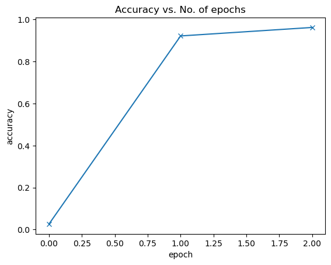

Classification Report: 

                                                    precision    recall  f1-score   support

                                Apple___Apple_scab       0.97      0.95      0.96       504
                                 Apple___Black_rot       0.97      0.99      0.98       497
                          Apple___Cedar_apple_rust       0.98      0.98      0.98       440
                                   Apple___healthy       0.98      0.97      0.98       502
                               Blueberry___healthy       0.97      1.00      0.98       454
          Cherry_(including_sour)___Powdery_mildew       0.98      1.00      0.99       421
                 Cherry_(including_sour)___healthy       0.99      1.00      0.99       456
Corn_(maize)___Cercospora_leaf_spot Gray_leaf_spot       0.94      0.90      0.92       410
                       Corn_(maize)___Common_rust_       1.00      0.99      0.99       477
               Corn_(maize)___Northern_Leaf_Blight       0.92      0.94      0.93       477
                            Corn_(maize)___healthy       0.99      1.00      1.00       465
                                 Grape___Black_rot       0.97      0.98      0.98       472
                      Grape___Esca_(Black_Measles)       0.98      0.98      0.98       480
        Grape___Leaf_blight_(Isariopsis_Leaf_Spot)       1.00      0.99      1.00       430
                                   Grape___healthy       1.00      0.99      0.99       423
          Orange___Haunglongbing_(Citrus_greening)       0.99      1.00      1.00       503
                            Peach___Bacterial_spot       0.97      0.97      0.97       459
                                   Peach___healthy       0.99      0.99      0.99       432
                     Pepper,_bell___Bacterial_spot       0.96      0.98      0.97       478
                            Pepper,_bell___healthy       0.96      0.98      0.97       497
                             Potato___Early_blight       0.99      0.97      0.98       485
                              Potato___Late_blight       0.93      0.95      0.94       485
                                  Potato___healthy       0.97      0.97      0.97       456
                               Raspberry___healthy       0.99      1.00      0.99       445
                                 Soybean___healthy       0.98      0.99      0.98       505
                           Squash___Powdery_mildew       1.00      1.00      1.00       434
                          Strawberry___Leaf_scorch       0.99      1.00      0.99       444
                              Strawberry___healthy       0.99      1.00      0.99       456
                           Tomato___Bacterial_spot       0.95      0.96      0.95       425
                             Tomato___Early_blight       0.89      0.81      0.85       480
                              Tomato___Late_blight       0.88      0.90      0.89       463
                                Tomato___Leaf_Mold       0.93      0.93      0.93       470
                       Tomato___Septoria_leaf_spot       0.94      0.84      0.89       436
     Tomato___Spider_mites Two-spotted_spider_mite       0.88      0.92      0.90       435
                              Tomato___Target_Spot       0.85      0.86      0.85       457
            Tomato___Tomato_Yellow_Leaf_Curl_Virus       0.95      0.98      0.96       490
                      Tomato___Tomato_mosaic_virus       0.98      0.95      0.96       448
                                  Tomato___healthy       0.96      0.96      0.96       481

                                          accuracy                           0.96     17572
                                         macro avg       0.96      0.96      0.96     17572
                                      weighted avg       0.96      0.96      0.96     17572

Balanced accuracy score: 
0.962035797815418

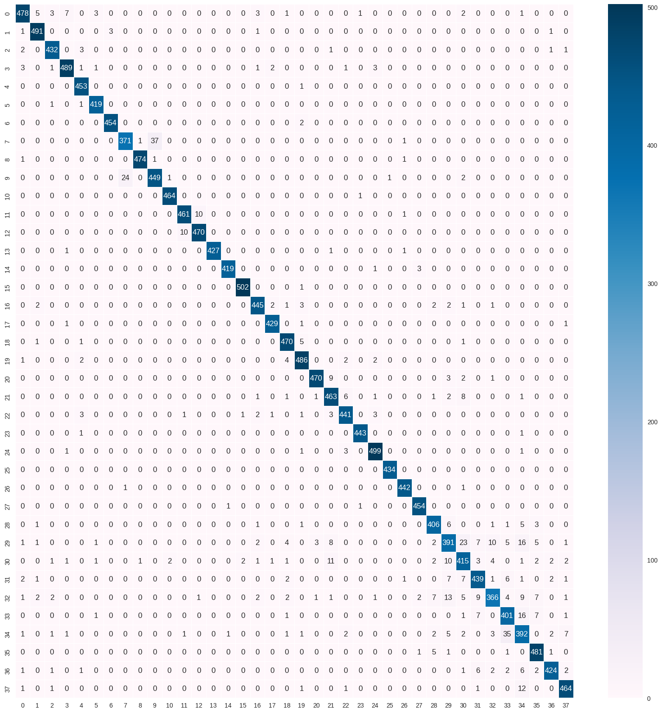

### RESNET 34

----------------------------------------------------------------
        Layer (type)               Output Shape         Param #
================================================================
            Conv2d-1         [-1, 64, 128, 128]           9,408
       BatchNorm2d-2         [-1, 64, 128, 128]             128
              ReLU-3         [-1, 64, 128, 128]               0
         MaxPool2d-4           [-1, 64, 64, 64]               0
            Conv2d-5           [-1, 64, 64, 64]          36,864
       BatchNorm2d-6           [-1, 64, 64, 64]             128
              ReLU-7           [-1, 64, 64, 64]               0
            Conv2d-8           [-1, 64, 64, 64]          36,864
       BatchNorm2d-9           [-1, 64, 64, 64]             128
             ReLU-10           [-1, 64, 64, 64]               0
       BasicBlock-11           [-1, 64, 64, 64]               0
           Conv2d-12           [-1, 64, 64, 64]          36,864
      BatchNorm2d-13           [-1, 64, 64, 64]             128
             ReLU-14           [-1, 64, 64, 64]               0
           Conv2d-15           [-1, 64, 64, 64]          36,864
      BatchNorm2d-16           [-1, 64, 64, 64]             128
             ReLU-17           [-1, 64, 64, 64]               0
       BasicBlock-18           [-1, 64, 64, 64]               0
           Conv2d-19           [-1, 64, 64, 64]          36,864
      BatchNorm2d-20           [-1, 64, 64, 64]             128
             ReLU-21           [-1, 64, 64, 64]               0
           Conv2d-22           [-1, 64, 64, 64]          36,864
      BatchNorm2d-23           [-1, 64, 64, 64]             128
             ReLU-24           [-1, 64, 64, 64]               0
       BasicBlock-25           [-1, 64, 64, 64]               0
           Conv2d-26          [-1, 128, 32, 32]          73,728
      BatchNorm2d-27          [-1, 128, 32, 32]             256
             ReLU-28          [-1, 128, 32, 32]               0
           Conv2d-29          [-1, 128, 32, 32]         147,456
      BatchNorm2d-30          [-1, 128, 32, 32]             256
           Conv2d-31          [-1, 128, 32, 32]           8,192
      BatchNorm2d-32          [-1, 128, 32, 32]             256
             ReLU-33          [-1, 128, 32, 32]               0
       BasicBlock-34          [-1, 128, 32, 32]               0
           Conv2d-35          [-1, 128, 32, 32]         147,456
      BatchNorm2d-36          [-1, 128, 32, 32]             256
             ReLU-37          [-1, 128, 32, 32]               0
           Conv2d-38          [-1, 128, 32, 32]         147,456
      BatchNorm2d-39          [-1, 128, 32, 32]             256
             ReLU-40          [-1, 128, 32, 32]               0
       BasicBlock-41          [-1, 128, 32, 32]               0
           Conv2d-42          [-1, 128, 32, 32]         147,456
      BatchNorm2d-43          [-1, 128, 32, 32]             256
             ReLU-44          [-1, 128, 32, 32]               0
           Conv2d-45          [-1, 128, 32, 32]         147,456
      BatchNorm2d-46          [-1, 128, 32, 32]             256
             ReLU-47          [-1, 128, 32, 32]               0
       BasicBlock-48          [-1, 128, 32, 32]               0
           Conv2d-49          [-1, 128, 32, 32]         147,456
      BatchNorm2d-50          [-1, 128, 32, 32]             256
             ReLU-51          [-1, 128, 32, 32]               0
           Conv2d-52          [-1, 128, 32, 32]         147,456
      BatchNorm2d-53          [-1, 128, 32, 32]             256
             ReLU-54          [-1, 128, 32, 32]               0
       BasicBlock-55          [-1, 128, 32, 32]               0
           Conv2d-56          [-1, 256, 16, 16]         294,912
      BatchNorm2d-57          [-1, 256, 16, 16]             512
             ReLU-58          [-1, 256, 16, 16]               0
           Conv2d-59          [-1, 256, 16, 16]         589,824
      BatchNorm2d-60          [-1, 256, 16, 16]             512
           Conv2d-61          [-1, 256, 16, 16]          32,768
      BatchNorm2d-62          [-1, 256, 16, 16]             512
             ReLU-63          [-1, 256, 16, 16]               0
       BasicBlock-64          [-1, 256, 16, 16]               0
           Conv2d-65          [-1, 256, 16, 16]         589,824
      BatchNorm2d-66          [-1, 256, 16, 16]             512
             ReLU-67          [-1, 256, 16, 16]               0
           Conv2d-68          [-1, 256, 16, 16]         589,824
      BatchNorm2d-69          [-1, 256, 16, 16]             512
             ReLU-70          [-1, 256, 16, 16]               0
       BasicBlock-71          [-1, 256, 16, 16]               0
           Conv2d-72          [-1, 256, 16, 16]         589,824
      BatchNorm2d-73          [-1, 256, 16, 16]             512
             ReLU-74          [-1, 256, 16, 16]               0
           Conv2d-75          [-1, 256, 16, 16]         589,824
      BatchNorm2d-76          [-1, 256, 16, 16]             512
             ReLU-77          [-1, 256, 16, 16]               0
       BasicBlock-78          [-1, 256, 16, 16]               0
           Conv2d-79          [-1, 256, 16, 16]         589,824
      BatchNorm2d-80          [-1, 256, 16, 16]             512
             ReLU-81          [-1, 256, 16, 16]               0
           Conv2d-82          [-1, 256, 16, 16]         589,824
      BatchNorm2d-83          [-1, 256, 16, 16]             512
             ReLU-84          [-1, 256, 16, 16]               0
       BasicBlock-85          [-1, 256, 16, 16]               0
           Conv2d-86          [-1, 256, 16, 16]         589,824
      BatchNorm2d-87          [-1, 256, 16, 16]             512
             ReLU-88          [-1, 256, 16, 16]               0
           Conv2d-89          [-1, 256, 16, 16]         589,824
      BatchNorm2d-90          [-1, 256, 16, 16]             512
             ReLU-91          [-1, 256, 16, 16]               0
       BasicBlock-92          [-1, 256, 16, 16]               0
           Conv2d-93          [-1, 256, 16, 16]         589,824
      BatchNorm2d-94          [-1, 256, 16, 16]             512
             ReLU-95          [-1, 256, 16, 16]               0
           Conv2d-96          [-1, 256, 16, 16]         589,824
      BatchNorm2d-97          [-1, 256, 16, 16]             512
             ReLU-98          [-1, 256, 16, 16]               0
       BasicBlock-99          [-1, 256, 16, 16]               0
          Conv2d-100            [-1, 512, 8, 8]       1,179,648
     BatchNorm2d-101            [-1, 512, 8, 8]           1,024
            ReLU-102            [-1, 512, 8, 8]               0
          Conv2d-103            [-1, 512, 8, 8]       2,359,296
     BatchNorm2d-104            [-1, 512, 8, 8]           1,024
          Conv2d-105            [-1, 512, 8, 8]         131,072
     BatchNorm2d-106            [-1, 512, 8, 8]           1,024
            ReLU-107            [-1, 512, 8, 8]               0
      BasicBlock-108            [-1, 512, 8, 8]               0
          Conv2d-109            [-1, 512, 8, 8]       2,359,296
     BatchNorm2d-110            [-1, 512, 8, 8]           1,024
            ReLU-111            [-1, 512, 8, 8]               0
          Conv2d-112            [-1, 512, 8, 8]       2,359,296
     BatchNorm2d-113            [-1, 512, 8, 8]           1,024
            ReLU-114            [-1, 512, 8, 8]               0
      BasicBlock-115            [-1, 512, 8, 8]               0
          Conv2d-116            [-1, 512, 8, 8]       2,359,296
     BatchNorm2d-117            [-1, 512, 8, 8]           1,024
            ReLU-118            [-1, 512, 8, 8]               0
          Conv2d-119            [-1, 512, 8, 8]       2,359,296
     BatchNorm2d-120            [-1, 512, 8, 8]           1,024
            ReLU-121            [-1, 512, 8, 8]               0
      BasicBlock-122            [-1, 512, 8, 8]               0
AdaptiveAvgPool2d-123            [-1, 512, 1, 1]               0
          Linear-124                   [-1, 38]          19,494
================================================================
Total params: 21,304,166
Trainable params: 19,494
Non-trainable params: 21,284,672
----------------------------------------------------------------
Input size (MB): 0.75
Forward/backward pass size (MB): 125.75
Params size (MB): 81.27
Estimated Total Size (MB): 207.77
----------------------------------------------------------------

Epoch [0], last_lr: 0.00812, train_loss: 0.7205, val_loss: 0.4138, val_acc: 0.9009
Epoch [1], last_lr: 0.00000, train_loss: 0.2279, val_loss: 0.1445, val_acc: 0.9576
CPU times: user 2min 51s, sys: 3min 39s, total: 6min 31s
Wall time: 5min 39s

Classification Report: 

                                                    precision    recall  f1-score   support

                                Apple___Apple_scab       0.97      0.94      0.96       504
                                 Apple___Black_rot       0.98      0.99      0.99       497
                          Apple___Cedar_apple_rust       0.96      0.97      0.97       440
                                   Apple___healthy       0.96      1.00      0.98       502
                               Blueberry___healthy       0.95      0.99      0.97       454
          Cherry_(including_sour)___Powdery_mildew       0.99      0.99      0.99       421
                 Cherry_(including_sour)___healthy       0.99      0.99      0.99       456
Corn_(maize)___Cercospora_leaf_spot Gray_leaf_spot       0.95      0.91      0.93       410
                       Corn_(maize)___Common_rust_       1.00      0.99      1.00       477
               Corn_(maize)___Northern_Leaf_Blight       0.92      0.96      0.94       477
                            Corn_(maize)___healthy       1.00      1.00      1.00       465
                                 Grape___Black_rot       0.95      0.97      0.96       472
                      Grape___Esca_(Black_Measles)       0.96      0.96      0.96       480
        Grape___Leaf_blight_(Isariopsis_Leaf_Spot)       0.99      1.00      0.99       430
                                   Grape___healthy       1.00      0.99      0.99       423
          Orange___Haunglongbing_(Citrus_greening)       0.99      1.00      1.00       503
                            Peach___Bacterial_spot       0.98      0.97      0.98       459
                                   Peach___healthy       0.98      0.99      0.99       432
                     Pepper,_bell___Bacterial_spot       0.97      0.98      0.98       478
                            Pepper,_bell___healthy       0.97      0.96      0.96       497
                             Potato___Early_blight       0.99      0.99      0.99       485
                              Potato___Late_blight       0.96      0.96      0.96       485
                                  Potato___healthy       0.93      0.95      0.94       456
                               Raspberry___healthy       0.99      0.98      0.99       445
                                 Soybean___healthy       0.99      0.97      0.98       505
                           Squash___Powdery_mildew       1.00      1.00      1.00       434
                          Strawberry___Leaf_scorch       0.98      0.99      0.99       444
                              Strawberry___healthy       0.99      1.00      1.00       456
                           Tomato___Bacterial_spot       0.91      0.96      0.94       425
                             Tomato___Early_blight       0.88      0.78      0.83       480
                              Tomato___Late_blight       0.87      0.88      0.87       463
                                Tomato___Leaf_Mold       0.92      0.93      0.92       470
                       Tomato___Septoria_leaf_spot       0.87      0.87      0.87       436
     Tomato___Spider_mites Two-spotted_spider_mite       0.91      0.90      0.91       435
                              Tomato___Target_Spot       0.88      0.81      0.84       457
            Tomato___Tomato_Yellow_Leaf_Curl_Virus       0.96      0.97      0.97       490
                      Tomato___Tomato_mosaic_virus       0.93      0.94      0.94       448
                                  Tomato___healthy       0.95      0.97      0.96       481

                                          accuracy                           0.96     17572
                                         macro avg       0.96      0.96      0.96     17572
                                      weighted avg       0.96      0.96      0.96     17572

Balanced accuracy score: 
0.9573455178425663

### RESNET 50 

Epoch [0], last_lr: 0.00812, train_loss: 0.5092, val_loss: 0.1357, val_acc: 0.9585
Epoch [1], last_lr: 0.00000, train_loss: 0.0957, val_loss: 0.0778, val_acc: 0.9798
CPU times: total: 1min 24s
Wall time: 8min 22s

Classification Report: 

                                                    precision    recall  f1-score   support

                                Apple___Apple_scab       0.99      0.99      0.99       504
                                 Apple___Black_rot       0.99      1.00      0.99       497
                          Apple___Cedar_apple_rust       1.00      1.00      1.00       440
                                   Apple___healthy       0.99      0.98      0.99       502
                               Blueberry___healthy       0.99      1.00      0.99       454
          Cherry_(including_sour)___Powdery_mildew       1.00      1.00      1.00       421
                 Cherry_(including_sour)___healthy       0.99      1.00      1.00       456
Corn_(maize)___Cercospora_leaf_spot Gray_leaf_spot       0.94      0.94      0.94       410
                       Corn_(maize)___Common_rust_       1.00      0.99      0.99       477
               Corn_(maize)___Northern_Leaf_Blight       0.95      0.95      0.95       477
                            Corn_(maize)___healthy       1.00      1.00      1.00       465
                                 Grape___Black_rot       0.99      0.98      0.98       472
                      Grape___Esca_(Black_Measles)       0.98      0.99      0.98       480
        Grape___Leaf_blight_(Isariopsis_Leaf_Spot)       1.00      1.00      1.00       430
                                   Grape___healthy       1.00      1.00      1.00       423
          Orange___Haunglongbing_(Citrus_greening)       1.00      1.00      1.00       503
                            Peach___Bacterial_spot       0.98      1.00      0.99       459
                                   Peach___healthy       1.00      1.00      1.00       432
                     Pepper,_bell___Bacterial_spot       0.99      0.98      0.99       478
                            Pepper,_bell___healthy       0.99      0.99      0.99       497
                             Potato___Early_blight       1.00      0.99      0.99       485
                              Potato___Late_blight       0.99      0.98      0.98       485
                                  Potato___healthy       0.99      0.98      0.99       456
                               Raspberry___healthy       0.99      0.99      0.99       445
                                 Soybean___healthy       0.99      0.99      0.99       505
                           Squash___Powdery_mildew       1.00      1.00      1.00       434
                          Strawberry___Leaf_scorch       1.00      1.00      1.00       444
                              Strawberry___healthy       0.99      0.99      0.99       456
                           Tomato___Bacterial_spot       0.95      0.98      0.97       425
                             Tomato___Early_blight       0.94      0.92      0.93       480
                              Tomato___Late_blight       0.94      0.94      0.94       463
                                Tomato___Leaf_Mold       0.96      0.98      0.97       470
                       Tomato___Septoria_leaf_spot       0.96      0.94      0.95       436
     Tomato___Spider_mites Two-spotted_spider_mite       0.95      0.93      0.94       435
                              Tomato___Target_Spot       0.91      0.90      0.91       457
            Tomato___Tomato_Yellow_Leaf_Curl_Virus       0.99      0.99      0.99       490
                      Tomato___Tomato_mosaic_virus       0.98      0.99      0.98       448
                                  Tomato___healthy       0.96      0.98      0.97       481

                                          accuracy                           0.98     17572
                                         macro avg       0.98      0.98      0.98     17572
                                      weighted avg       0.98      0.98      0.98     17572

Balanced accuracy score: 
0.9796687464326652

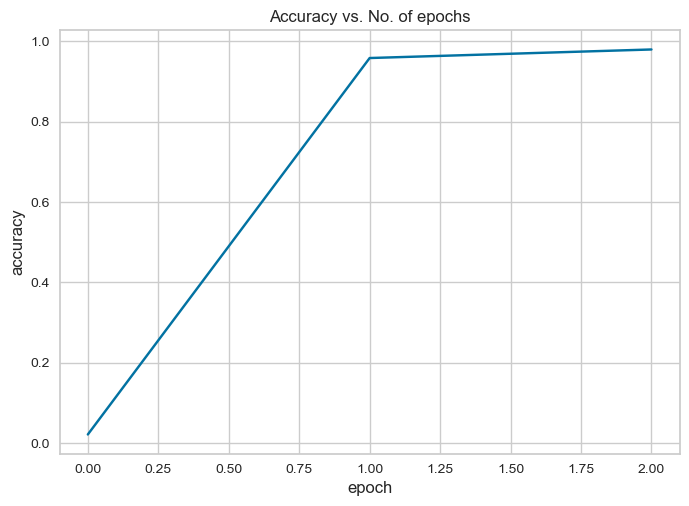

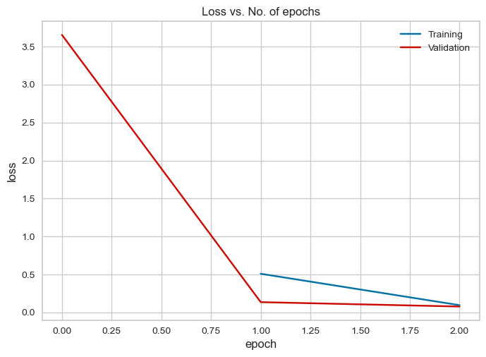

## PRE-TRAINED WITH PLANT DATASET

### RESNET 34

----------------------------------------------------------------
        Layer (type)               Output Shape         Param #
================================================================
            Conv2d-1         [-1, 64, 128, 128]           9,408
       BatchNorm2d-2         [-1, 64, 128, 128]             128
              ReLU-3         [-1, 64, 128, 128]               0
         MaxPool2d-4           [-1, 64, 64, 64]               0
            Conv2d-5           [-1, 64, 64, 64]          36,864
       BatchNorm2d-6           [-1, 64, 64, 64]             128
              ReLU-7           [-1, 64, 64, 64]               0
            Conv2d-8           [-1, 64, 64, 64]          36,864
       BatchNorm2d-9           [-1, 64, 64, 64]             128
             ReLU-10           [-1, 64, 64, 64]               0
       BasicBlock-11           [-1, 64, 64, 64]               0
           Conv2d-12           [-1, 64, 64, 64]          36,864
      BatchNorm2d-13           [-1, 64, 64, 64]             128
             ReLU-14           [-1, 64, 64, 64]               0
           Conv2d-15           [-1, 64, 64, 64]          36,864
      BatchNorm2d-16           [-1, 64, 64, 64]             128
             ReLU-17           [-1, 64, 64, 64]               0
       BasicBlock-18           [-1, 64, 64, 64]               0
           Conv2d-19           [-1, 64, 64, 64]          36,864
      BatchNorm2d-20           [-1, 64, 64, 64]             128
             ReLU-21           [-1, 64, 64, 64]               0
           Conv2d-22           [-1, 64, 64, 64]          36,864
      BatchNorm2d-23           [-1, 64, 64, 64]             128
             ReLU-24           [-1, 64, 64, 64]               0
       BasicBlock-25           [-1, 64, 64, 64]               0
           Conv2d-26          [-1, 128, 32, 32]          73,728
      BatchNorm2d-27          [-1, 128, 32, 32]             256
             ReLU-28          [-1, 128, 32, 32]               0
           Conv2d-29          [-1, 128, 32, 32]         147,456
      BatchNorm2d-30          [-1, 128, 32, 32]             256
           Conv2d-31          [-1, 128, 32, 32]           8,192
      BatchNorm2d-32          [-1, 128, 32, 32]             256
             ReLU-33          [-1, 128, 32, 32]               0
       BasicBlock-34          [-1, 128, 32, 32]               0
           Conv2d-35          [-1, 128, 32, 32]         147,456
      BatchNorm2d-36          [-1, 128, 32, 32]             256
             ReLU-37          [-1, 128, 32, 32]               0
           Conv2d-38          [-1, 128, 32, 32]         147,456
      BatchNorm2d-39          [-1, 128, 32, 32]             256
             ReLU-40          [-1, 128, 32, 32]               0
       BasicBlock-41          [-1, 128, 32, 32]               0
           Conv2d-42          [-1, 128, 32, 32]         147,456
      BatchNorm2d-43          [-1, 128, 32, 32]             256
             ReLU-44          [-1, 128, 32, 32]               0
           Conv2d-45          [-1, 128, 32, 32]         147,456
      BatchNorm2d-46          [-1, 128, 32, 32]             256
             ReLU-47          [-1, 128, 32, 32]               0
       BasicBlock-48          [-1, 128, 32, 32]               0
           Conv2d-49          [-1, 128, 32, 32]         147,456
      BatchNorm2d-50          [-1, 128, 32, 32]             256
             ReLU-51          [-1, 128, 32, 32]               0
           Conv2d-52          [-1, 128, 32, 32]         147,456
      BatchNorm2d-53          [-1, 128, 32, 32]             256
             ReLU-54          [-1, 128, 32, 32]               0
       BasicBlock-55          [-1, 128, 32, 32]               0
           Conv2d-56          [-1, 256, 16, 16]         294,912
      BatchNorm2d-57          [-1, 256, 16, 16]             512
             ReLU-58          [-1, 256, 16, 16]               0
           Conv2d-59          [-1, 256, 16, 16]         589,824
      BatchNorm2d-60          [-1, 256, 16, 16]             512
           Conv2d-61          [-1, 256, 16, 16]          32,768
      BatchNorm2d-62          [-1, 256, 16, 16]             512
             ReLU-63          [-1, 256, 16, 16]               0
       BasicBlock-64          [-1, 256, 16, 16]               0
           Conv2d-65          [-1, 256, 16, 16]         589,824
      BatchNorm2d-66          [-1, 256, 16, 16]             512
             ReLU-67          [-1, 256, 16, 16]               0
           Conv2d-68          [-1, 256, 16, 16]         589,824
      BatchNorm2d-69          [-1, 256, 16, 16]             512
             ReLU-70          [-1, 256, 16, 16]               0
       BasicBlock-71          [-1, 256, 16, 16]               0
           Conv2d-72          [-1, 256, 16, 16]         589,824
      BatchNorm2d-73          [-1, 256, 16, 16]             512
             ReLU-74          [-1, 256, 16, 16]               0
           Conv2d-75          [-1, 256, 16, 16]         589,824
      BatchNorm2d-76          [-1, 256, 16, 16]             512
             ReLU-77          [-1, 256, 16, 16]               0
       BasicBlock-78          [-1, 256, 16, 16]               0
           Conv2d-79          [-1, 256, 16, 16]         589,824
      BatchNorm2d-80          [-1, 256, 16, 16]             512
             ReLU-81          [-1, 256, 16, 16]               0
           Conv2d-82          [-1, 256, 16, 16]         589,824
      BatchNorm2d-83          [-1, 256, 16, 16]             512
             ReLU-84          [-1, 256, 16, 16]               0
       BasicBlock-85          [-1, 256, 16, 16]               0
           Conv2d-86          [-1, 256, 16, 16]         589,824
      BatchNorm2d-87          [-1, 256, 16, 16]             512
             ReLU-88          [-1, 256, 16, 16]               0
           Conv2d-89          [-1, 256, 16, 16]         589,824
      BatchNorm2d-90          [-1, 256, 16, 16]             512
             ReLU-91          [-1, 256, 16, 16]               0
       BasicBlock-92          [-1, 256, 16, 16]               0
           Conv2d-93          [-1, 256, 16, 16]         589,824
      BatchNorm2d-94          [-1, 256, 16, 16]             512
             ReLU-95          [-1, 256, 16, 16]               0
           Conv2d-96          [-1, 256, 16, 16]         589,824
      BatchNorm2d-97          [-1, 256, 16, 16]             512
             ReLU-98          [-1, 256, 16, 16]               0
       BasicBlock-99          [-1, 256, 16, 16]               0
          Conv2d-100            [-1, 512, 8, 8]       1,179,648
     BatchNorm2d-101            [-1, 512, 8, 8]           1,024
            ReLU-102            [-1, 512, 8, 8]               0
          Conv2d-103            [-1, 512, 8, 8]       2,359,296
     BatchNorm2d-104            [-1, 512, 8, 8]           1,024
          Conv2d-105            [-1, 512, 8, 8]         131,072
     BatchNorm2d-106            [-1, 512, 8, 8]           1,024
            ReLU-107            [-1, 512, 8, 8]               0
      BasicBlock-108            [-1, 512, 8, 8]               0
          Conv2d-109            [-1, 512, 8, 8]       2,359,296
     BatchNorm2d-110            [-1, 512, 8, 8]           1,024
            ReLU-111            [-1, 512, 8, 8]               0
          Conv2d-112            [-1, 512, 8, 8]       2,359,296
     BatchNorm2d-113            [-1, 512, 8, 8]           1,024
            ReLU-114            [-1, 512, 8, 8]               0
      BasicBlock-115            [-1, 512, 8, 8]               0
          Conv2d-116            [-1, 512, 8, 8]       2,359,296
     BatchNorm2d-117            [-1, 512, 8, 8]           1,024
            ReLU-118            [-1, 512, 8, 8]               0
          Conv2d-119            [-1, 512, 8, 8]       2,359,296
     BatchNorm2d-120            [-1, 512, 8, 8]           1,024
            ReLU-121            [-1, 512, 8, 8]               0
      BasicBlock-122            [-1, 512, 8, 8]               0
AdaptiveAvgPool2d-123            [-1, 512, 1, 1]               0
          Linear-124                   [-1, 38]          19,494
================================================================
Total params: 21,304,166
Trainable params: 19,494
Non-trainable params: 21,284,672
----------------------------------------------------------------
Input size (MB): 0.75
Forward/backward pass size (MB): 125.75
Params size (MB): 81.27
Estimated Total Size (MB): 207.77
----------------------------------------------------------------

Epoch [0], last_lr: 0.00812, train_loss: 0.7205, val_loss: 0.4138, val_acc: 0.9009
Epoch [1], last_lr: 0.00000, train_loss: 0.2279, val_loss: 0.1445, val_acc: 0.9576
CPU times: user 3min, sys: 3min 38s, total: 6min 38s
Wall time: 5min 41s

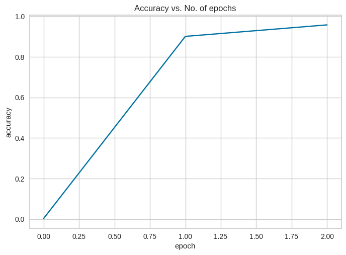

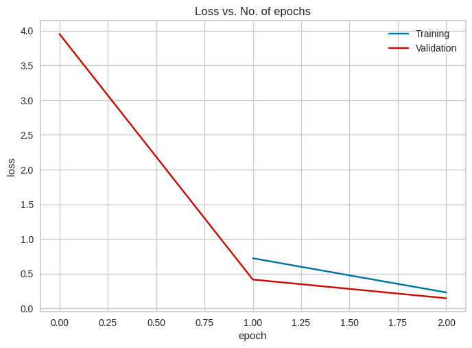

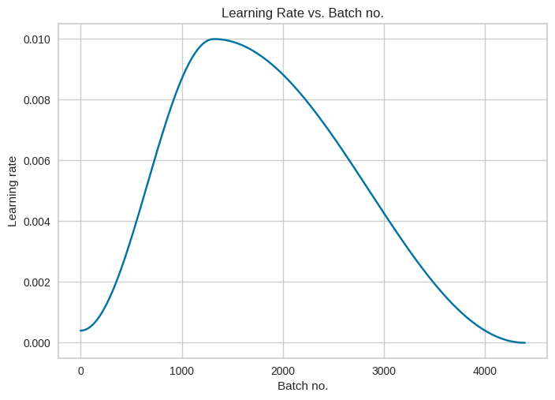

Classification Report: 

                                                    precision    recall  f1-score   support

                                Apple___Apple_scab       0.97      0.94      0.96       504
                                 Apple___Black_rot       0.98      0.99      0.99       497
                          Apple___Cedar_apple_rust       0.96      0.97      0.97       440
                                   Apple___healthy       0.96      1.00      0.98       502
                               Blueberry___healthy       0.95      0.99      0.97       454
          Cherry_(including_sour)___Powdery_mildew       0.99      0.99      0.99       421
                 Cherry_(including_sour)___healthy       0.99      0.99      0.99       456
Corn_(maize)___Cercospora_leaf_spot Gray_leaf_spot       0.95      0.91      0.93       410
                       Corn_(maize)___Common_rust_       1.00      0.99      1.00       477
               Corn_(maize)___Northern_Leaf_Blight       0.92      0.96      0.94       477
                            Corn_(maize)___healthy       1.00      1.00      1.00       465
                                 Grape___Black_rot       0.95      0.97      0.96       472
                      Grape___Esca_(Black_Measles)       0.96      0.96      0.96       480
        Grape___Leaf_blight_(Isariopsis_Leaf_Spot)       0.99      1.00      0.99       430
                                   Grape___healthy       1.00      0.99      0.99       423
          Orange___Haunglongbing_(Citrus_greening)       0.99      1.00      1.00       503
                            Peach___Bacterial_spot       0.98      0.97      0.98       459
                                   Peach___healthy       0.98      0.99      0.99       432
                     Pepper,_bell___Bacterial_spot       0.97      0.98      0.98       478
                            Pepper,_bell___healthy       0.97      0.96      0.96       497
                             Potato___Early_blight       0.99      0.99      0.99       485
                              Potato___Late_blight       0.96      0.96      0.96       485
                                  Potato___healthy       0.93      0.95      0.94       456
                               Raspberry___healthy       0.99      0.98      0.99       445
                                 Soybean___healthy       0.99      0.97      0.98       505
                           Squash___Powdery_mildew       1.00      1.00      1.00       434
                          Strawberry___Leaf_scorch       0.98      0.99      0.99       444
                              Strawberry___healthy       0.99      1.00      1.00       456
                           Tomato___Bacterial_spot       0.91      0.96      0.94       425
                             Tomato___Early_blight       0.88      0.78      0.83       480
                              Tomato___Late_blight       0.87      0.88      0.87       463
                                Tomato___Leaf_Mold       0.92      0.93      0.92       470
                       Tomato___Septoria_leaf_spot       0.87      0.87      0.87       436
     Tomato___Spider_mites Two-spotted_spider_mite       0.91      0.90      0.91       435
                              Tomato___Target_Spot       0.88      0.81      0.84       457
            Tomato___Tomato_Yellow_Leaf_Curl_Virus       0.96      0.97      0.97       490
                      Tomato___Tomato_mosaic_virus       0.93      0.94      0.94       448
                                  Tomato___healthy       0.95      0.97      0.96       481

                                          accuracy                           0.96     17572
                                         macro avg       0.96      0.96      0.96     17572
                                      weighted avg       0.96      0.96      0.96     17572

Balanced accuracy score: 
0.9573455178425663

### RESNET 50

Epoch [0], last_lr: 0.00812, train_loss: 0.9108, val_loss: 0.5806, val_acc: 0.9151
Epoch [1], last_lr: 0.00000, train_loss: 0.3101, val_loss: 0.1453, val_acc: 0.9679
CPU times: total: 1min 19s
Wall time: 8min 28s

Classification Report: 

                                                    precision    recall  f1-score   support

                                Apple___Apple_scab       0.99      0.98      0.99       504
                                 Apple___Black_rot       0.97      0.99      0.98       497
                          Apple___Cedar_apple_rust       1.00      0.98      0.99       440
                                   Apple___healthy       0.98      0.98      0.98       502
                               Blueberry___healthy       0.96      1.00      0.98       454
          Cherry_(including_sour)___Powdery_mildew       0.99      0.98      0.99       421
                 Cherry_(including_sour)___healthy       0.98      0.99      0.99       456
Corn_(maize)___Cercospora_leaf_spot Gray_leaf_spot       0.92      0.93      0.93       410
                       Corn_(maize)___Common_rust_       0.98      1.00      0.99       477
               Corn_(maize)___Northern_Leaf_Blight       0.94      0.93      0.93       477
                            Corn_(maize)___healthy       1.00      1.00      1.00       465
                                 Grape___Black_rot       0.98      0.97      0.98       472
                      Grape___Esca_(Black_Measles)       0.98      0.98      0.98       480
        Grape___Leaf_blight_(Isariopsis_Leaf_Spot)       0.99      1.00      1.00       430
                                   Grape___healthy       1.00      1.00      1.00       423
          Orange___Haunglongbing_(Citrus_greening)       0.98      1.00      0.99       503
                            Peach___Bacterial_spot       1.00      0.97      0.98       459
                                   Peach___healthy       0.99      0.99      0.99       432
                     Pepper,_bell___Bacterial_spot       0.99      0.98      0.98       478
                            Pepper,_bell___healthy       0.98      0.97      0.97       497
                             Potato___Early_blight       0.99      0.99      0.99       485
                              Potato___Late_blight       0.96      0.96      0.96       485
                                  Potato___healthy       0.99      0.96      0.98       456
                               Raspberry___healthy       0.99      1.00      1.00       445
                                 Soybean___healthy       0.99      0.98      0.99       505
                           Squash___Powdery_mildew       1.00      1.00      1.00       434
                          Strawberry___Leaf_scorch       0.99      1.00      0.99       444
                              Strawberry___healthy       1.00      1.00      1.00       456
                           Tomato___Bacterial_spot       0.94      0.98      0.96       425
                             Tomato___Early_blight       0.86      0.88      0.87       480
                              Tomato___Late_blight       0.91      0.91      0.91       463
                                Tomato___Leaf_Mold       0.95      0.91      0.93       470
                       Tomato___Septoria_leaf_spot       0.92      0.88      0.90       436
     Tomato___Spider_mites Two-spotted_spider_mite       0.93      0.92      0.93       435
                              Tomato___Target_Spot       0.85      0.88      0.87       457
            Tomato___Tomato_Yellow_Leaf_Curl_Virus       0.98      0.98      0.98       490
                      Tomato___Tomato_mosaic_virus       0.97      0.95      0.96       448
                                  Tomato___healthy       0.97      0.98      0.97       481

                                          accuracy                           0.97     17572
                                         macro avg       0.97      0.97      0.97     17572
                                      weighted avg       0.97      0.97      0.97     17572

Balanced accuracy score: 
0.9676906942061161

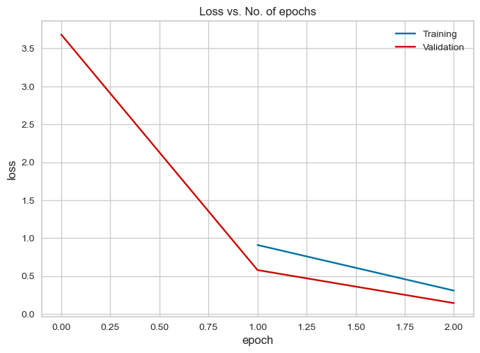

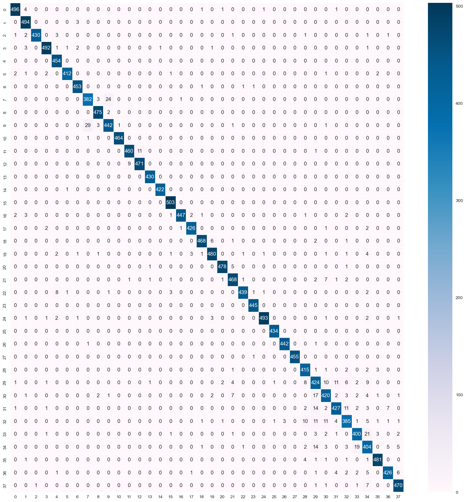

## CUSTOM

### RESNET 9 

CPU times: user 15.1 s, sys: 46.6 s, total: 1min 1s
Wall time: 56.1 s
Epoch [0], last_lr: 0.00812, train_loss: 1.0336, val_loss: 1.1076, val_acc: 0.6997
Epoch [1], last_lr: 0.00000, train_loss: 0.2143, val_loss: 0.0509, val_acc: 0.9836
CPU times: user 12min 35s, sys: 14min 45s, total: 27min 21s
Wall time: 26min 33s
----------------------------------------------------------------
        Layer (type)               Output Shape         Param #
================================================================
            Conv2d-1         [-1, 64, 256, 256]           1,792
       BatchNorm2d-2         [-1, 64, 256, 256]             128
              ReLU-3         [-1, 64, 256, 256]               0
            Conv2d-4        [-1, 128, 256, 256]          73,856
       BatchNorm2d-5        [-1, 128, 256, 256]             256
              ReLU-6        [-1, 128, 256, 256]               0
         MaxPool2d-7          [-1, 128, 64, 64]               0
            Conv2d-8          [-1, 128, 64, 64]         147,584
       BatchNorm2d-9          [-1, 128, 64, 64]             256
             ReLU-10          [-1, 128, 64, 64]               0
           Conv2d-11          [-1, 128, 64, 64]         147,584
      BatchNorm2d-12          [-1, 128, 64, 64]             256
             ReLU-13          [-1, 128, 64, 64]               0
           Conv2d-14          [-1, 256, 64, 64]         295,168
      BatchNorm2d-15          [-1, 256, 64, 64]             512
             ReLU-16          [-1, 256, 64, 64]               0
        MaxPool2d-17          [-1, 256, 16, 16]               0
           Conv2d-18          [-1, 512, 16, 16]       1,180,160
      BatchNorm2d-19          [-1, 512, 16, 16]           1,024
             ReLU-20          [-1, 512, 16, 16]               0
        MaxPool2d-21            [-1, 512, 4, 4]               0
           Conv2d-22            [-1, 512, 4, 4]       2,359,808
      BatchNorm2d-23            [-1, 512, 4, 4]           1,024
             ReLU-24            [-1, 512, 4, 4]               0
           Conv2d-25            [-1, 512, 4, 4]       2,359,808
      BatchNorm2d-26            [-1, 512, 4, 4]           1,024
             ReLU-27            [-1, 512, 4, 4]               0
        MaxPool2d-28            [-1, 512, 1, 1]               0
          Flatten-29                  [-1, 512]               0
           Linear-30                   [-1, 38]          19,494
================================================================
Total params: 6,589,734
Trainable params: 6,589,734
Non-trainable params: 0

Epoch [0], last_lr: 0.00812, train_loss: 1.0336, val_loss: 1.1076, val_acc: 0.6997
Epoch [1], last_lr: 0.00000, train_loss: 0.2143, val_loss: 0.0509, val_acc: 0.9836
CPU times: user 12min 35s, sys: 14min 45s, total: 27min 21s
Wall time: 26min 33s

CPU times: user 15.1 s, sys: 46.6 s, total: 1min 1s
Wall time: 56.1 s
Epoch [0], last_lr: 0.00812, train_loss: 1.0336, val_loss: 1.1076, val_acc: 0.6997
Epoch [1], last_lr: 0.00000, train_loss: 0.2143, val_loss: 0.0509, val_acc: 0.9836
CPU times: user 12min 35s, sys: 14min 45s, total: 27min 21s
Wall time: 26min 33s
----------------------------------------------------------------
        Layer (type)               Output Shape         Param #
================================================================
            Conv2d-1         [-1, 64, 256, 256]           1,792
       BatchNorm2d-2         [-1, 64, 256, 256]             128
              ReLU-3         [-1, 64, 256, 256]               0
            Conv2d-4        [-1, 128, 256, 256]          73,856
       BatchNorm2d-5        [-1, 128, 256, 256]             256
              ReLU-6        [-1, 128, 256, 256]               0
         MaxPool2d-7          [-1, 128, 64, 64]               0
            Conv2d-8          [-1, 128, 64, 64]         147,584
       BatchNorm2d-9          [-1, 128, 64, 64]             256
             ReLU-10          [-1, 128, 64, 64]               0
           Conv2d-11          [-1, 128, 64, 64]         147,584
      BatchNorm2d-12          [-1, 128, 64, 64]             256
             ReLU-13          [-1, 128, 64, 64]               0
           Conv2d-14          [-1, 256, 64, 64]         295,168
      BatchNorm2d-15          [-1, 256, 64, 64]             512
             ReLU-16          [-1, 256, 64, 64]               0
        MaxPool2d-17          [-1, 256, 16, 16]               0
           Conv2d-18          [-1, 512, 16, 16]       1,180,160
      BatchNorm2d-19          [-1, 512, 16, 16]           1,024
             ReLU-20          [-1, 512, 16, 16]               0
        MaxPool2d-21            [-1, 512, 4, 4]               0
           Conv2d-22            [-1, 512, 4, 4]       2,359,808
      BatchNorm2d-23            [-1, 512, 4, 4]           1,024
             ReLU-24            [-1, 512, 4, 4]               0
           Conv2d-25            [-1, 512, 4, 4]       2,359,808
      BatchNorm2d-26            [-1, 512, 4, 4]           1,024
             ReLU-27            [-1, 512, 4, 4]               0
        MaxPool2d-28            [-1, 512, 1, 1]               0
          Flatten-29                  [-1, 512]               0
           Linear-30                   [-1, 38]          19,494
================================================================
Total params: 6,589,734
Trainable params: 6,589,734
Non-trainable params: 0
----------------------------------------------------------------
Input size (MB): 0.75
Forward/backward pass size (MB): 343.95
Params size (MB): 25.14
Estimated Total Size (MB): 369.83
----------------------------------------------------------------
None

Classification Report: 

                                                    precision    recall  f1-score   support

                                Apple___Apple_scab       0.99      0.96      0.98       504
                                 Apple___Black_rot       0.99      0.99      0.99       497
                          Apple___Cedar_apple_rust       0.99      1.00      0.99       440
                                   Apple___healthy       0.98      0.98      0.98       502
                               Blueberry___healthy       0.98      0.99      0.99       454
          Cherry_(including_sour)___Powdery_mildew       1.00      1.00      1.00       421
                 Cherry_(including_sour)___healthy       0.99      1.00      1.00       456
Corn_(maize)___Cercospora_leaf_spot Gray_leaf_spot       0.97      0.94      0.96       410
                       Corn_(maize)___Common_rust_       1.00      1.00      1.00       477
               Corn_(maize)___Northern_Leaf_Blight       0.95      0.98      0.97       477
                            Corn_(maize)___healthy       1.00      1.00      1.00       465
                                 Grape___Black_rot       0.99      0.99      0.99       472
                      Grape___Esca_(Black_Measles)       0.99      1.00      0.99       480
        Grape___Leaf_blight_(Isariopsis_Leaf_Spot)       1.00      1.00      1.00       430
                                   Grape___healthy       1.00      1.00      1.00       423
          Orange___Haunglongbing_(Citrus_greening)       0.99      0.99      0.99       503
                            Peach___Bacterial_spot       0.98      0.99      0.98       459
                                   Peach___healthy       0.99      1.00      0.99       432
                     Pepper,_bell___Bacterial_spot       0.99      0.99      0.99       478
                            Pepper,_bell___healthy       0.98      0.99      0.98       497
                             Potato___Early_blight       0.98      1.00      0.99       485
                              Potato___Late_blight       0.97      0.98      0.98       485
                                  Potato___healthy       0.99      0.97      0.98       456
                               Raspberry___healthy       0.98      1.00      0.99       445
                                 Soybean___healthy       0.99      1.00      0.99       505
                           Squash___Powdery_mildew       0.99      1.00      1.00       434
                          Strawberry___Leaf_scorch       1.00      1.00      1.00       444
                              Strawberry___healthy       1.00      1.00      1.00       456
                           Tomato___Bacterial_spot       0.99      0.96      0.97       425
                             Tomato___Early_blight       0.95      0.95      0.95       480
                              Tomato___Late_blight       0.95      0.95      0.95       463
                                Tomato___Leaf_Mold       0.99      0.99      0.99       470
                       Tomato___Septoria_leaf_spot       0.99      0.93      0.96       436
     Tomato___Spider_mites Two-spotted_spider_mite       0.98      0.98      0.98       435
                              Tomato___Target_Spot       0.95      0.92      0.94       457
            Tomato___Tomato_Yellow_Leaf_Curl_Virus       0.98      1.00      0.99       490
                      Tomato___Tomato_mosaic_virus       0.99      1.00      0.99       448
                                  Tomato___healthy       0.96      1.00      0.98       481

                                          accuracy                           0.98     17572
                                         macro avg       0.98      0.98      0.98     17572
                                      weighted avg       0.98      0.98      0.98     17572

Balanced accuracy score: 
0.9834003766234095

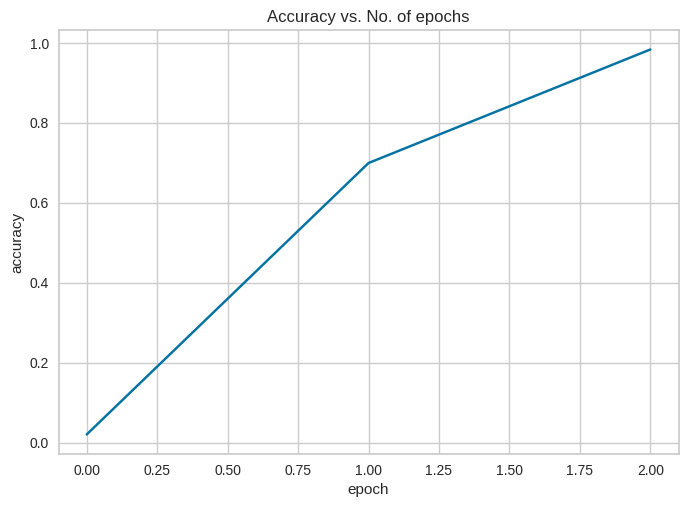

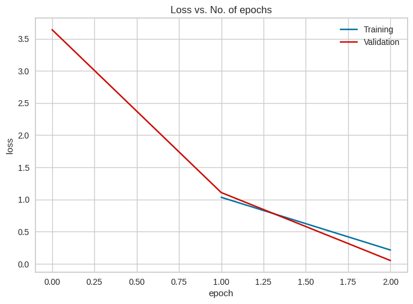

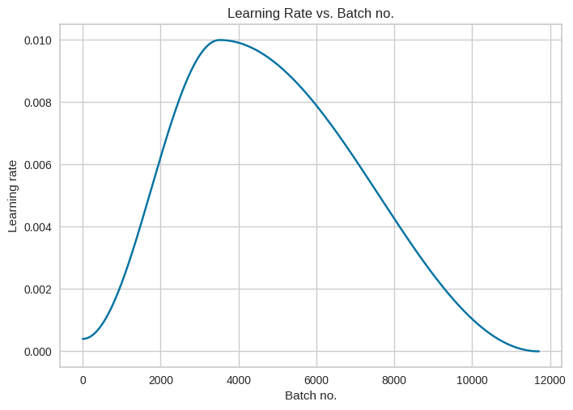

### RESNET 34

----------------------------------------------------------------
        Layer (type)               Output Shape         Param #
================================================================
            Conv2d-1         [-1, 64, 256, 256]           1,728
       BatchNorm2d-2         [-1, 64, 256, 256]             128
            Conv2d-3         [-1, 64, 256, 256]          36,864
       BatchNorm2d-4         [-1, 64, 256, 256]             128
            Conv2d-5         [-1, 64, 256, 256]          36,864
       BatchNorm2d-6         [-1, 64, 256, 256]             128
        BasicBlock-7         [-1, 64, 256, 256]               0
            Conv2d-8         [-1, 64, 256, 256]          36,864
       BatchNorm2d-9         [-1, 64, 256, 256]             128
           Conv2d-10         [-1, 64, 256, 256]          36,864
      BatchNorm2d-11         [-1, 64, 256, 256]             128
       BasicBlock-12         [-1, 64, 256, 256]               0
           Conv2d-13         [-1, 64, 256, 256]          36,864
      BatchNorm2d-14         [-1, 64, 256, 256]             128
           Conv2d-15         [-1, 64, 256, 256]          36,864
      BatchNorm2d-16         [-1, 64, 256, 256]             128
       BasicBlock-17         [-1, 64, 256, 256]               0
           Conv2d-18        [-1, 128, 128, 128]          73,728
      BatchNorm2d-19        [-1, 128, 128, 128]             256
           Conv2d-20        [-1, 128, 128, 128]         147,456
      BatchNorm2d-21        [-1, 128, 128, 128]             256
           Conv2d-22        [-1, 128, 128, 128]           8,192
      BatchNorm2d-23        [-1, 128, 128, 128]             256
       BasicBlock-24        [-1, 128, 128, 128]               0
           Conv2d-25        [-1, 128, 128, 128]         147,456
      BatchNorm2d-26        [-1, 128, 128, 128]             256
           Conv2d-27        [-1, 128, 128, 128]         147,456
      BatchNorm2d-28        [-1, 128, 128, 128]             256
       BasicBlock-29        [-1, 128, 128, 128]               0
           Conv2d-30        [-1, 128, 128, 128]         147,456
      BatchNorm2d-31        [-1, 128, 128, 128]             256
           Conv2d-32        [-1, 128, 128, 128]         147,456
      BatchNorm2d-33        [-1, 128, 128, 128]             256
       BasicBlock-34        [-1, 128, 128, 128]               0
           Conv2d-35        [-1, 128, 128, 128]         147,456
      BatchNorm2d-36        [-1, 128, 128, 128]             256
           Conv2d-37        [-1, 128, 128, 128]         147,456
      BatchNorm2d-38        [-1, 128, 128, 128]             256
       BasicBlock-39        [-1, 128, 128, 128]               0
           Conv2d-40          [-1, 256, 64, 64]         294,912
      BatchNorm2d-41          [-1, 256, 64, 64]             512
           Conv2d-42          [-1, 256, 64, 64]         589,824
      BatchNorm2d-43          [-1, 256, 64, 64]             512
           Conv2d-44          [-1, 256, 64, 64]          32,768
      BatchNorm2d-45          [-1, 256, 64, 64]             512
       BasicBlock-46          [-1, 256, 64, 64]               0
           Conv2d-47          [-1, 256, 64, 64]         589,824
      BatchNorm2d-48          [-1, 256, 64, 64]             512
           Conv2d-49          [-1, 256, 64, 64]         589,824
      BatchNorm2d-50          [-1, 256, 64, 64]             512
       BasicBlock-51          [-1, 256, 64, 64]               0
           Conv2d-52          [-1, 256, 64, 64]         589,824
      BatchNorm2d-53          [-1, 256, 64, 64]             512
           Conv2d-54          [-1, 256, 64, 64]         589,824
      BatchNorm2d-55          [-1, 256, 64, 64]             512
       BasicBlock-56          [-1, 256, 64, 64]               0
           Conv2d-57          [-1, 256, 64, 64]         589,824
      BatchNorm2d-58          [-1, 256, 64, 64]             512
           Conv2d-59          [-1, 256, 64, 64]         589,824
      BatchNorm2d-60          [-1, 256, 64, 64]             512
       BasicBlock-61          [-1, 256, 64, 64]               0
           Conv2d-62          [-1, 256, 64, 64]         589,824
      BatchNorm2d-63          [-1, 256, 64, 64]             512
           Conv2d-64          [-1, 256, 64, 64]         589,824
      BatchNorm2d-65          [-1, 256, 64, 64]             512
       BasicBlock-66          [-1, 256, 64, 64]               0
           Conv2d-67          [-1, 256, 64, 64]         589,824
      BatchNorm2d-68          [-1, 256, 64, 64]             512
           Conv2d-69          [-1, 256, 64, 64]         589,824
      BatchNorm2d-70          [-1, 256, 64, 64]             512
       BasicBlock-71          [-1, 256, 64, 64]               0
           Conv2d-72          [-1, 512, 32, 32]       1,179,648
      BatchNorm2d-73          [-1, 512, 32, 32]           1,024
           Conv2d-74          [-1, 512, 32, 32]       2,359,296
      BatchNorm2d-75          [-1, 512, 32, 32]           1,024
           Conv2d-76          [-1, 512, 32, 32]         131,072
      BatchNorm2d-77          [-1, 512, 32, 32]           1,024
       BasicBlock-78          [-1, 512, 32, 32]               0
           Conv2d-79          [-1, 512, 32, 32]       2,359,296
      BatchNorm2d-80          [-1, 512, 32, 32]           1,024
           Conv2d-81          [-1, 512, 32, 32]       2,359,296
      BatchNorm2d-82          [-1, 512, 32, 32]           1,024
       BasicBlock-83          [-1, 512, 32, 32]               0
           Conv2d-84          [-1, 512, 32, 32]       2,359,296
      BatchNorm2d-85          [-1, 512, 32, 32]           1,024
           Conv2d-86          [-1, 512, 32, 32]       2,359,296
      BatchNorm2d-87          [-1, 512, 32, 32]           1,024
       BasicBlock-88          [-1, 512, 32, 32]               0
           Linear-89                   [-1, 38]          19,494
================================================================
Total params: 21,296,486
Trainable params: 21,296,486
Non-trainable params: 0
----------------------------------------------------------------
Input size (MB): 0.75
Forward/backward pass size (MB): 1220.00
Params size (MB): 81.24
Estimated Total Size (MB): 1301.99
----------------------------------------------------------------
None

Epoch [0], last_lr: 0.00812, train_loss: 1.7991, val_loss: 1.4175, val_acc: 0.6088
Epoch [1], last_lr: 0.00000, train_loss: 0.5160, val_loss: 0.2660, val_acc: 0.9255
CPU times: total: 10min 49s
Wall time: 3h 25min 39s

                                Apple___Apple_scab       0.98      0.94      0.96       504
                                 Apple___Black_rot       0.94      0.98      0.96       497
                          Apple___Cedar_apple_rust       0.92      0.95      0.94       440
                                   Apple___healthy       0.91      0.94      0.92       502
                               Blueberry___healthy       0.93      0.93      0.93       454
          Cherry_(including_sour)___Powdery_mildew       0.96      0.96      0.96       421
                 Cherry_(including_sour)___healthy       0.90      1.00      0.94       456
Corn_(maize)___Cercospora_leaf_spot Gray_leaf_spot       0.96      0.80      0.87       410
                       Corn_(maize)___Common_rust_       0.94      0.97      0.95       477
               Corn_(maize)___Northern_Leaf_Blight       0.84      0.97      0.90       477
                            Corn_(maize)___healthy       0.98      0.98      0.98       465
                                 Grape___Black_rot       0.94      0.93      0.94       472
                      Grape___Esca_(Black_Measles)       0.94      0.97      0.96       480
        Grape___Leaf_blight_(Isariopsis_Leaf_Spot)       0.96      0.95      0.96       430
                                   Grape___healthy       0.95      0.96      0.96       423
          Orange___Haunglongbing_(Citrus_greening)       0.95      0.93      0.94       503
                            Peach___Bacterial_spot       0.93      0.91      0.92       459
                                   Peach___healthy       0.90      0.98      0.94       432
                     Pepper,_bell___Bacterial_spot       0.92      0.92      0.92       478
                            Pepper,_bell___healthy       0.94      0.84      0.89       497
                             Potato___Early_blight       0.95      0.97      0.96       485
                              Potato___Late_blight       0.80      0.94      0.87       485
                                  Potato___healthy       0.96      0.91      0.93       456
                               Raspberry___healthy       0.98      0.96      0.97       445
                                 Soybean___healthy       0.93      0.93      0.93       505
                           Squash___Powdery_mildew       0.97      0.98      0.97       434
                          Strawberry___Leaf_scorch       0.97      0.97      0.97       444
                              Strawberry___healthy       0.96      0.99      0.98       456
                           Tomato___Bacterial_spot       0.93      0.89      0.91       425
                             Tomato___Early_blight       0.89      0.81      0.85       480
                              Tomato___Late_blight       0.85      0.60      0.70       463
                                Tomato___Leaf_Mold       0.92      0.96      0.94       470
                       Tomato___Septoria_leaf_spot       0.94      0.85      0.89       436
     Tomato___Spider_mites Two-spotted_spider_mite       0.86      0.94      0.90       435
                              Tomato___Target_Spot       0.92      0.78      0.84       457
            Tomato___Tomato_Yellow_Leaf_Curl_Virus       0.94      0.90      0.92       490
                      Tomato___Tomato_mosaic_virus       0.90      0.98      0.94       448
                                  Tomato___healthy       0.87      0.99      0.93       481

                                          accuracy                           0.93     17572
                                         macro avg       0.93      0.93      0.92     17572
                                      weighted avg       0.93      0.93      0.92     17572

Balanced accuracy score: 
0.9253299028210584

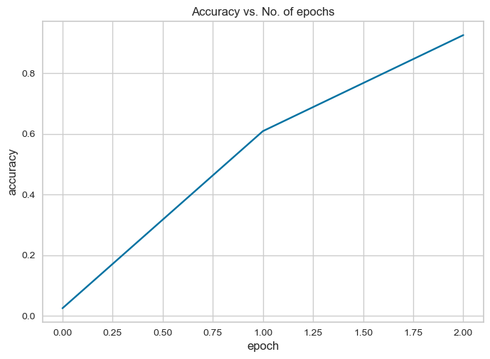

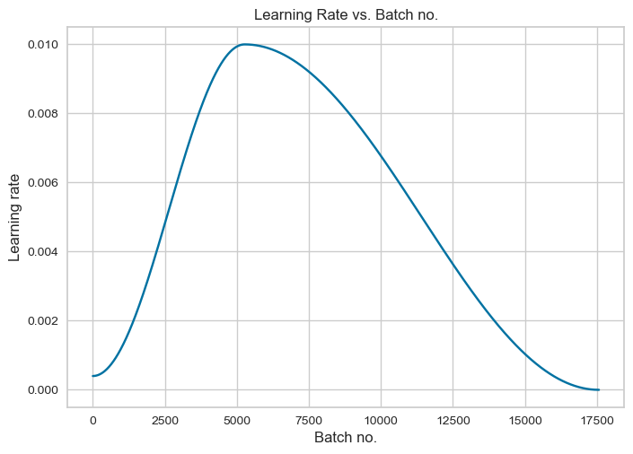

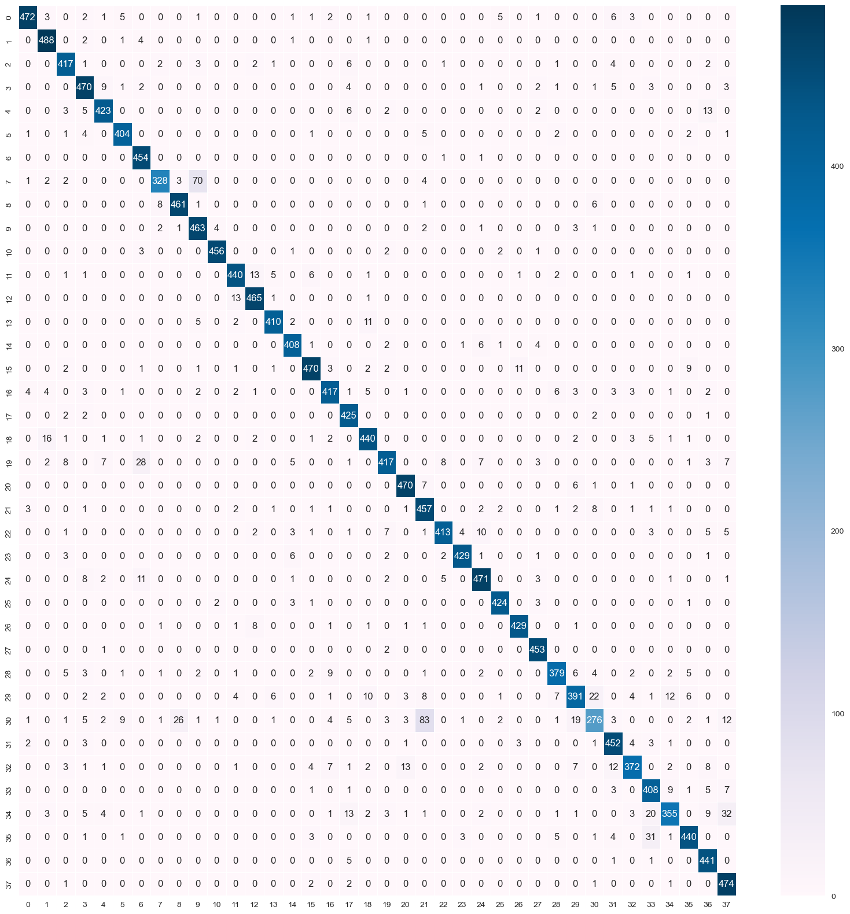

### RESNET 18

Epoch [0], last_lr: 0.00812, train_loss: 1.5222, val_loss: 2.1334, val_acc: 0.4786
Epoch [1], last_lr: 0.00000, train_loss: 0.4980, val_loss: 0.2209, val_acc: 0.9344
CPU times: user 2h 15s, sys: 2h 6min 31s, total: 4h 6min 46s
Wall time: 4h 6min 41s

----------------------------------------------------------------
        Layer (type)               Output Shape         Param #
================================================================
            Conv2d-1         [-1, 64, 256, 256]           1,728
       BatchNorm2d-2         [-1, 64, 256, 256]             128
            Conv2d-3         [-1, 64, 256, 256]          36,864
       BatchNorm2d-4         [-1, 64, 256, 256]             128
            Conv2d-5         [-1, 64, 256, 256]          36,864
       BatchNorm2d-6         [-1, 64, 256, 256]             128
        BasicBlock-7         [-1, 64, 256, 256]               0
            Conv2d-8         [-1, 64, 256, 256]          36,864
       BatchNorm2d-9         [-1, 64, 256, 256]             128
           Conv2d-10         [-1, 64, 256, 256]          36,864
      BatchNorm2d-11         [-1, 64, 256, 256]             128
       BasicBlock-12         [-1, 64, 256, 256]               0
           Conv2d-13        [-1, 128, 128, 128]          73,728
      BatchNorm2d-14        [-1, 128, 128, 128]             256
           Conv2d-15        [-1, 128, 128, 128]         147,456
      BatchNorm2d-16        [-1, 128, 128, 128]             256
           Conv2d-17        [-1, 128, 128, 128]           8,192
      BatchNorm2d-18        [-1, 128, 128, 128]             256
       BasicBlock-19        [-1, 128, 128, 128]               0
           Conv2d-20        [-1, 128, 128, 128]         147,456
      BatchNorm2d-21        [-1, 128, 128, 128]             256
           Conv2d-22        [-1, 128, 128, 128]         147,456
      BatchNorm2d-23        [-1, 128, 128, 128]             256
       BasicBlock-24        [-1, 128, 128, 128]               0
           Conv2d-25          [-1, 256, 64, 64]         294,912
      BatchNorm2d-26          [-1, 256, 64, 64]             512
           Conv2d-27          [-1, 256, 64, 64]         589,824
      BatchNorm2d-28          [-1, 256, 64, 64]             512
           Conv2d-29          [-1, 256, 64, 64]          32,768
      BatchNorm2d-30          [-1, 256, 64, 64]             512
       BasicBlock-31          [-1, 256, 64, 64]               0
           Conv2d-32          [-1, 256, 64, 64]         589,824
      BatchNorm2d-33          [-1, 256, 64, 64]             512
           Conv2d-34          [-1, 256, 64, 64]         589,824
      BatchNorm2d-35          [-1, 256, 64, 64]             512
       BasicBlock-36          [-1, 256, 64, 64]               0
           Conv2d-37          [-1, 512, 32, 32]       1,179,648
      BatchNorm2d-38          [-1, 512, 32, 32]           1,024
           Conv2d-39          [-1, 512, 32, 32]       2,359,296
      BatchNorm2d-40          [-1, 512, 32, 32]           1,024
           Conv2d-41          [-1, 512, 32, 32]         131,072
      BatchNorm2d-42          [-1, 512, 32, 32]           1,024
       BasicBlock-43          [-1, 512, 32, 32]               0
           Conv2d-44          [-1, 512, 32, 32]       2,359,296
      BatchNorm2d-45          [-1, 512, 32, 32]           1,024
           Conv2d-46          [-1, 512, 32, 32]       2,359,296
      BatchNorm2d-47          [-1, 512, 32, 32]           1,024
       BasicBlock-48          [-1, 512, 32, 32]               0
           Linear-49                   [-1, 38]          19,494
================================================================
Total params: 11,188,326
Trainable params: 11,188,326
Non-trainable params: 0
----------------------------------------------------------------
Input size (MB): 0.75
Forward/backward pass size (MB): 720.00
Params size (MB): 42.68
Estimated Total Size (MB): 763.43
----------------------------------------------------------------
None

Classification Report: 

                                                    precision    recall  f1-score   support
                                Apple___Apple_scab       0.94      0.95      0.95       504
                                 Apple___Black_rot       0.97      0.96      0.97       497
                          Apple___Cedar_apple_rust       0.95      0.92      0.93       440
                                   Apple___healthy       0.88      0.94      0.91       502
                               Blueberry___healthy       0.95      0.96      0.95       454
          Cherry_(including_sour)___Powdery_mildew       0.91      0.96      0.93       421
                 Cherry_(including_sour)___healthy       0.92      0.99      0.95       456
Corn_(maize)___Cercospora_leaf_spot Gray_leaf_spot       0.98      0.82      0.89       410
                       Corn_(maize)___Common_rust_       0.95      0.99      0.97       477
               Corn_(maize)___Northern_Leaf_Blight       0.86      0.97      0.91       477
                            Corn_(maize)___healthy       0.98      0.97      0.97       465
                                 Grape___Black_rot       0.93      0.91      0.92       472
                      Grape___Esca_(Black_Measles)       0.97      0.95      0.96       480
        Grape___Leaf_blight_(Isariopsis_Leaf_Spot)       0.99      0.98      0.98       430
                                   Grape___healthy       0.94      0.96      0.95       423
          Orange___Haunglongbing_(Citrus_greening)       0.91      0.97      0.94       503
                            Peach___Bacterial_spot       0.94      0.85      0.89       459
                                   Peach___healthy       0.86      0.98      0.92       432
                     Pepper,_bell___Bacterial_spot       0.93      0.94      0.93       478
                            Pepper,_bell___healthy       0.93      0.86      0.89       497
                             Potato___Early_blight       0.99      0.98      0.98       485
                              Potato___Late_blight       0.89      0.91      0.90       485
                                  Potato___healthy       0.95      0.91      0.93       456
                               Raspberry___healthy       0.95      0.97      0.96       445
                                 Soybean___healthy       0.94      0.93      0.93       505
                           Squash___Powdery_mildew       0.96      0.98      0.97       434
                          Strawberry___Leaf_scorch       0.98      0.99      0.99       444
                              Strawberry___healthy       0.96      1.00      0.98       456
                           Tomato___Bacterial_spot       0.92      0.91      0.91       425
                             Tomato___Early_blight       0.89      0.84      0.87       480
                              Tomato___Late_blight       0.85      0.75      0.80       463
                                Tomato___Leaf_Mold       0.92      0.96      0.94       470
                       Tomato___Septoria_leaf_spot       0.94      0.84      0.89       436
     Tomato___Spider_mites Two-spotted_spider_mite       0.89      0.95      0.92       435
                              Tomato___Target_Spot       0.94      0.87      0.90       457
            Tomato___Tomato_Yellow_Leaf_Curl_Virus       0.95      0.97      0.96       490
                      Tomato___Tomato_mosaic_virus       0.97      0.94      0.95       448
                                  Tomato___healthy       0.97      0.98      0.98       481

                                          accuracy                           0.93     17572
                                         macro avg       0.94      0.93      0.93     17572
                                      weighted avg       0.94      0.93      0.93     17572

Balanced accuracy score: 
0.9341941003488756

