### LR 0.01 (Daniel)

#### Weight Decay 1e-4 ()

Epoch [0], last_lr: 0.00812, train_loss: 1.5222, val_loss: 2.1334, val_acc: 0.4786
Epoch [1], last_lr: 0.00000, train_loss: 0.4980, val_loss: 0.2209, val_acc: 0.9344
CPU times: user 2h 15s, sys: 2h 6min 31s, total: 4h 6min 46s
Wall time: 4h 6min 41s

#### Weight Decay 1e-3 (1)

CPU times: total: 2min 29s
Wall time: 3min 11s
Epoch [0], last_lr: 0.00812, train_loss: 1.8254, val_loss: 3.5677, val_acc: 0.3110
Epoch [1], last_lr: 0.00000, train_loss: 0.9746, val_loss: 0.5613, val_acc: 0.8521
CPU times: total: 5min 10s
Wall time: 1h 33min 29s

Classification Report: 

                                                    precision    recall  f1-score   support

                                Apple___Apple_scab       0.93      0.81      0.86       504
                                 Apple___Black_rot       0.91      0.91      0.91       497
                          Apple___Cedar_apple_rust       0.83      0.83      0.83       440
                                   Apple___healthy       0.84      0.85      0.84       502
                               Blueberry___healthy       0.85      0.88      0.87       454
          Cherry_(including_sour)___Powdery_mildew       0.80      0.92      0.85       421
                 Cherry_(including_sour)___healthy       0.81      0.92      0.86       456
Corn_(maize)___Cercospora_leaf_spot Gray_leaf_spot       0.96      0.67      0.79       410
                       Corn_(maize)___Common_rust_       0.88      0.98      0.93       477
               Corn_(maize)___Northern_Leaf_Blight       0.78      0.95      0.86       477
                            Corn_(maize)___healthy       0.95      0.98      0.97       465
                                 Grape___Black_rot       0.82      0.73      0.77       472
                      Grape___Esca_(Black_Measles)       0.91      0.91      0.91       480
        Grape___Leaf_blight_(Isariopsis_Leaf_Spot)       0.93      0.93      0.93       430
                                   Grape___healthy       0.81      0.88      0.84       423
          Orange___Haunglongbing_(Citrus_greening)       0.81      0.90      0.85       503
                            Peach___Bacterial_spot       0.83      0.76      0.79       459
                                   Peach___healthy       0.88      0.97      0.92       432
                     Pepper,_bell___Bacterial_spot       0.82      0.85      0.84       478
                            Pepper,_bell___healthy       0.85      0.68      0.76       497
                             Potato___Early_blight       0.88      0.96      0.92       485
                              Potato___Late_blight       0.74      0.90      0.81       485
                                  Potato___healthy       0.78      0.86      0.82       456
                               Raspberry___healthy       0.95      0.82      0.88       445
                                 Soybean___healthy       0.80      0.89      0.84       505
                           Squash___Powdery_mildew       0.93      0.94      0.93       434
                          Strawberry___Leaf_scorch       0.92      0.95      0.94       444
                              Strawberry___healthy       0.94      0.97      0.96       456
                           Tomato___Bacterial_spot       0.86      0.81      0.83       425
                             Tomato___Early_blight       0.82      0.64      0.72       480
                              Tomato___Late_blight       0.78      0.57      0.66       463
                                Tomato___Leaf_Mold       0.82      0.91      0.86       470
                       Tomato___Septoria_leaf_spot       0.88      0.61      0.72       436
     Tomato___Spider_mites Two-spotted_spider_mite       0.77      0.86      0.81       435
                              Tomato___Target_Spot       0.84      0.61      0.71       457
            Tomato___Tomato_Yellow_Leaf_Curl_Virus       0.83      0.80      0.82       490
                      Tomato___Tomato_mosaic_virus       0.85      0.97      0.91       448
                                  Tomato___healthy       0.91      0.98      0.94       481

                                          accuracy                           0.85     17572
                                         macro avg       0.85      0.85      0.85     17572
                                      weighted avg       0.85      0.85      0.85     17572

Balanced accuracy score: 
0.851779446137099

### LR 0.001 (Artur)

#### Weight Decay 1e-4 (3)

Epoch [0], last_lr: 0.00081, train_loss: 1.2162, val_loss: 0.7683, val_acc: 0.7798
Epoch [1], last_lr: 0.00000, train_loss: 0.3286, val_loss: 0.0958, val_acc: 0.9738
CPU times: user 1h 37min 58s, sys: 1h 47min 29s, total: 3h 25min 28s
Wall time: 3h 24min 58s

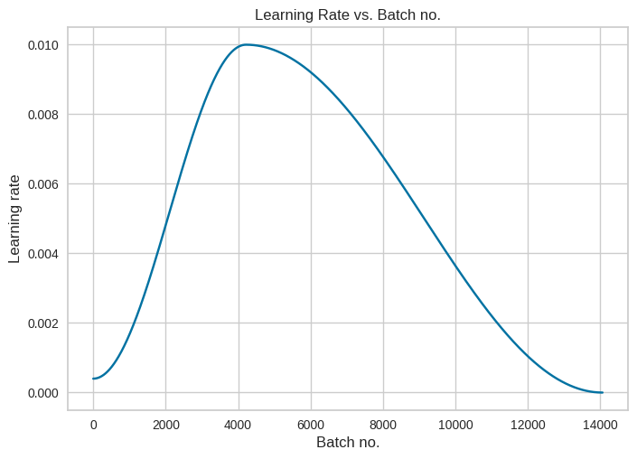

CPU times: user 8min 4s, sys: 3.48 s, total: 8min 7s
Wall time: 8min 2s
Epoch [0], last_lr: 0.00081, train_loss: 1.2162, val_loss: 0.7683, val_acc: 0.7798
Epoch [1], last_lr: 0.00000, train_loss: 0.3286, val_loss: 0.0958, val_acc: 0.9738
CPU times: user 1h 37min 58s, sys: 1h 47min 29s, total: 3h 25min 28s
Wall time: 3h 24min 58s

Classification Report: 

                                                    precision    recall  f1-score   support

                                Apple___Apple_scab       0.94      0.95      0.95       504
                                 Apple___Black_rot       0.97      0.96      0.97       497
                          Apple___Cedar_apple_rust       0.95      0.92      0.93       440
                                   Apple___healthy       0.88      0.94      0.91       502
                               Blueberry___healthy       0.95      0.96      0.95       454
          Cherry_(including_sour)___Powdery_mildew       0.91      0.96      0.93       421
                 Cherry_(including_sour)___healthy       0.92      0.99      0.95       456
Corn_(maize)___Cercospora_leaf_spot Gray_leaf_spot       0.98      0.82      0.89       410
                       Corn_(maize)___Common_rust_       0.95      0.99      0.97       477
               Corn_(maize)___Northern_Leaf_Blight       0.86      0.97      0.91       477
                            Corn_(maize)___healthy       0.98      0.97      0.97       465
                                 Grape___Black_rot       0.93      0.91      0.92       472
                      Grape___Esca_(Black_Measles)       0.97      0.95      0.96       480
        Grape___Leaf_blight_(Isariopsis_Leaf_Spot)       0.99      0.98      0.98       430
                                   Grape___healthy       0.94      0.96      0.95       423
          Orange___Haunglongbing_(Citrus_greening)       0.91      0.97      0.94       503
                            Peach___Bacterial_spot       0.94      0.85      0.89       459
                                   Peach___healthy       0.86      0.98      0.92       432
                     Pepper,_bell___Bacterial_spot       0.93      0.94      0.93       478
                            Pepper,_bell___healthy       0.93      0.86      0.89       497
                             Potato___Early_blight       0.99      0.98      0.98       485
                              Potato___Late_blight       0.89      0.91      0.90       485
                                  Potato___healthy       0.95      0.91      0.93       456
                               Raspberry___healthy       0.95      0.97      0.96       445
                                 Soybean___healthy       0.94      0.93      0.93       505
                           Squash___Powdery_mildew       0.96      0.98      0.97       434
                          Strawberry___Leaf_scorch       0.98      0.99      0.99       444
                              Strawberry___healthy       0.96      1.00      0.98       456
                           Tomato___Bacterial_spot       0.92      0.91      0.91       425
                             Tomato___Early_blight       0.89      0.84      0.87       480
                              Tomato___Late_blight       0.85      0.75      0.80       463
                                Tomato___Leaf_Mold       0.92      0.96      0.94       470
                       Tomato___Septoria_leaf_spot       0.94      0.84      0.89       436
     Tomato___Spider_mites Two-spotted_spider_mite       0.89      0.95      0.92       435
                              Tomato___Target_Spot       0.94      0.87      0.90       457
            Tomato___Tomato_Yellow_Leaf_Curl_Virus       0.95      0.97      0.96       490
                      Tomato___Tomato_mosaic_virus       0.97      0.94      0.95       448
                                  Tomato___healthy       0.97      0.98      0.98       481

                                          accuracy                           0.93     17572
                                         macro avg       0.94      0.93      0.93     17572
                                      weighted avg       0.94      0.93      0.93     17572

Balanced accuracy score: 
0.9341941003488756

#### Weight Decay 1e-3 (4)

Epoch [0], last_lr: 0.00081, train_loss: 1.3363, val_loss: 1.0431, val_acc: 0.7080
Epoch [1], last_lr: 0.00000, train_loss: 0.4515, val_loss: 0.1512, val_acc: 0.9611
CPU times: user 1h 34min 4s, sys: 1h 47min 8s, total: 3h 21min 12s
Wall time: 3h 20min 42s

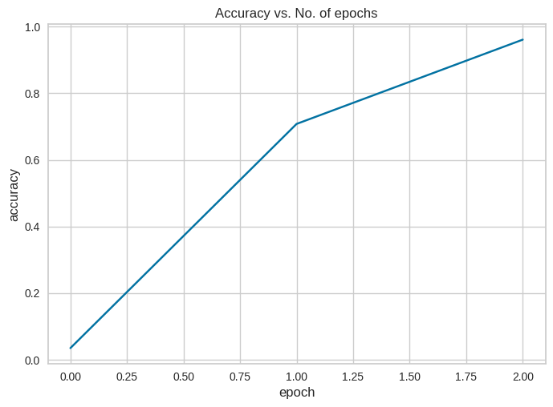

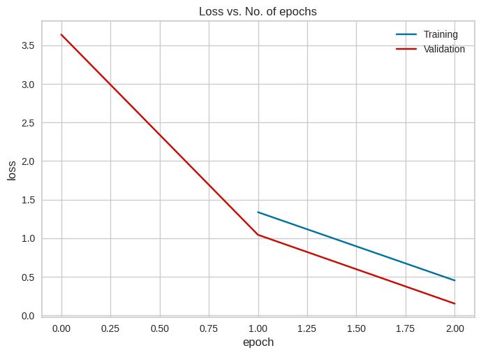

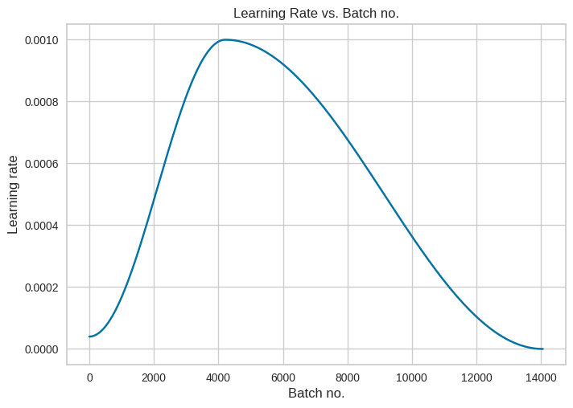

Classification Report: 

                                                    precision    recall  f1-score   support

                                Apple___Apple_scab       0.96      0.98      0.97       504
                                 Apple___Black_rot       0.99      0.97      0.98       497
                          Apple___Cedar_apple_rust       0.96      0.98      0.97       440
                                   Apple___healthy       0.95      0.98      0.97       502
                               Blueberry___healthy       0.96      0.99      0.97       454
          Cherry_(including_sour)___Powdery_mildew       0.96      0.95      0.95       421
                 Cherry_(including_sour)___healthy       0.96      1.00      0.98       456
Corn_(maize)___Cercospora_leaf_spot Gray_leaf_spot       0.97      0.89      0.92       410
                       Corn_(maize)___Common_rust_       0.95      0.99      0.97       477
               Corn_(maize)___Northern_Leaf_Blight       0.90      0.96      0.93       477
                            Corn_(maize)___healthy       0.99      0.98      0.99       465
                                 Grape___Black_rot       0.97      0.96      0.96       472
                      Grape___Esca_(Black_Measles)       0.98      0.97      0.98       480
        Grape___Leaf_blight_(Isariopsis_Leaf_Spot)       1.00      0.98      0.99       430
                                   Grape___healthy       0.97      0.99      0.98       423
          Orange___Haunglongbing_(Citrus_greening)       0.95      0.98      0.97       503
                            Peach___Bacterial_spot       1.00      0.97      0.98       459
                                   Peach___healthy       0.96      0.99      0.97       432
                     Pepper,_bell___Bacterial_spot       0.96      0.99      0.97       478
                            Pepper,_bell___healthy       0.99      0.95      0.97       497
                             Potato___Early_blight       1.00      0.99      0.99       485
                              Potato___Late_blight       0.92      0.95      0.94       485
                                  Potato___healthy       0.98      0.97      0.97       456
                               Raspberry___healthy       0.98      0.97      0.97       445
                                 Soybean___healthy       0.98      0.96      0.97       505
                           Squash___Powdery_mildew       0.98      1.00      0.99       434
                          Strawberry___Leaf_scorch       0.98      0.99      0.99       444
                              Strawberry___healthy       0.97      1.00      0.98       456
                           Tomato___Bacterial_spot       0.94      0.91      0.93       425
                             Tomato___Early_blight       0.92      0.87      0.89       480
                              Tomato___Late_blight       0.90      0.75      0.82       463
                                Tomato___Leaf_Mold       0.91      0.99      0.95       470
                       Tomato___Septoria_leaf_spot       0.97      0.93      0.95       436
     Tomato___Spider_mites Two-spotted_spider_mite       0.90      0.98      0.94       435
                              Tomato___Target_Spot       0.95      0.89      0.92       457
            Tomato___Tomato_Yellow_Leaf_Curl_Virus       0.97      0.97      0.97       490
                      Tomato___Tomato_mosaic_virus       0.98      1.00      0.99       448
                                  Tomato___healthy       0.97      0.99      0.98       481

                                          accuracy                           0.96     17572
                                         macro avg       0.96      0.96      0.96     17572
                                      weighted avg       0.96      0.96      0.96     17572

Balanced accuracy score: 
0.9609258795058804

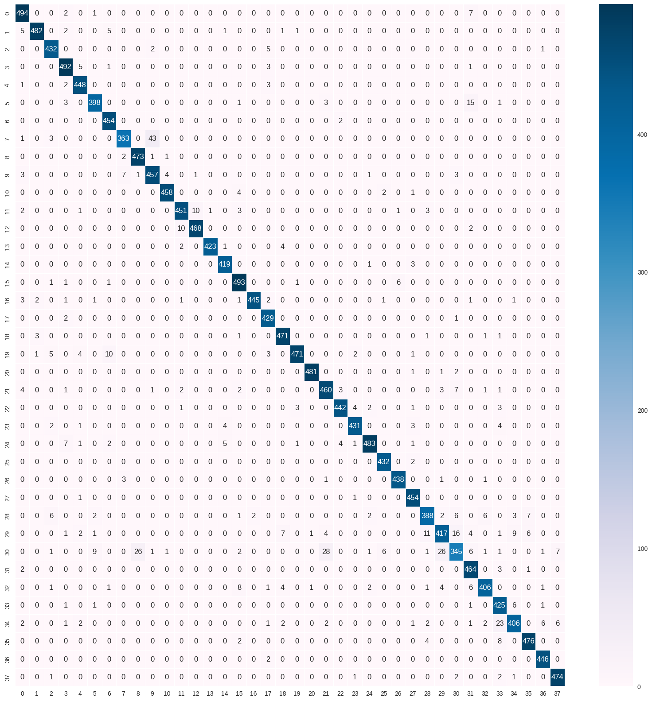

### LR 0.1

#### Weight Decay 1e-4 (2)

Epoch [0], last_lr: 0.08117, train_loss: 2.1637, val_loss: 1.6486, val_acc: 0.5037
Epoch [1], last_lr: 0.00000, train_loss: 1.1623, val_loss: 0.6520, val_acc: 0.8200
CPU times: total: 5min 35s
Wall time: 1h 37min 21s

Classification Report: 

                                                    precision    recall  f1-score   support
                                                    
                                Apple___Apple_scab       0.88      0.77      0.82       504
                                 Apple___Black_rot       0.92      0.87      0.89       497
                          Apple___Cedar_apple_rust       0.80      0.83      0.82       440
                                   Apple___healthy       0.80      0.81      0.81       502
                               Blueberry___healthy       0.83      0.89      0.86       454
          Cherry_(including_sour)___Powdery_mildew       0.84      0.84      0.84       421
                 Cherry_(including_sour)___healthy       0.79      0.91      0.84       456
Corn_(maize)___Cercospora_leaf_spot Gray_leaf_spot       0.87      0.65      0.74       410
                       Corn_(maize)___Common_rust_       0.87      0.94      0.90       477
               Corn_(maize)___Northern_Leaf_Blight       0.77      0.92      0.84       477
                            Corn_(maize)___healthy       0.97      0.99      0.98       465
                                 Grape___Black_rot       0.78      0.83      0.81       472
                      Grape___Esca_(Black_Measles)       0.91      0.88      0.89       480
        Grape___Leaf_blight_(Isariopsis_Leaf_Spot)       0.89      0.86      0.87       430
                                   Grape___healthy       0.75      0.83      0.79       423
          Orange___Haunglongbing_(Citrus_greening)       0.83      0.95      0.89       503
                            Peach___Bacterial_spot       0.85      0.63      0.72       459
                                   Peach___healthy       0.75      0.97      0.85       432
                     Pepper,_bell___Bacterial_spot       0.81      0.73      0.77       478
                            Pepper,_bell___healthy       0.78      0.59      0.67       497
                             Potato___Early_blight       0.85      0.97      0.91       485
                              Potato___Late_blight       0.71      0.84      0.77       485
                                  Potato___healthy       0.83      0.77      0.80       456
                               Raspberry___healthy       0.83      0.83      0.83       445
                                 Soybean___healthy       0.74      0.90      0.81       505
                           Squash___Powdery_mildew       0.92      0.93      0.92       434
                          Strawberry___Leaf_scorch       0.95      0.95      0.95       444
                              Strawberry___healthy       0.88      0.96      0.92       456
                           Tomato___Bacterial_spot       0.76      0.79      0.77       425
                             Tomato___Early_blight       0.71      0.61      0.66       480
                              Tomato___Late_blight       0.71      0.43      0.54       463
                                Tomato___Leaf_Mold       0.81      0.79      0.80       470
                       Tomato___Septoria_leaf_spot       0.71      0.52      0.60       436
     Tomato___Spider_mites Two-spotted_spider_mite       0.74      0.81      0.77       435
                              Tomato___Target_Spot       0.76      0.62      0.68       457
            Tomato___Tomato_Yellow_Leaf_Curl_Virus       0.81      0.85      0.83       490
                      Tomato___Tomato_mosaic_virus       0.87      0.89      0.88       448
                                  Tomato___healthy       0.88      0.97      0.92       481

                                          accuracy                           0.82     17572
                                         macro avg       0.82      0.82      0.81     17572
                                      weighted avg       0.82      0.82      0.82     17572

Balanced accuracy score: 
0.8192449743357362

### RESNET 34

Epoch [0], last_lr: 0.00081, train_loss: 1.4255, val_loss: 0.6524, val_acc: 0.8023
Epoch [1], last_lr: 0.00000, train_loss: 0.3694, val_loss: 0.0905, val_acc: 0.9727
CPU times: total: 9min 56s
Wall time: 2h 54min 35s

Classification Report: 

                                                    precision    recall  f1-score   support

                                Apple___Apple_scab       0.99      0.98      0.98       504
                                 Apple___Black_rot       0.99      1.00      0.99       497
                          Apple___Cedar_apple_rust       0.95      0.98      0.96       440
                                   Apple___healthy       0.98      0.98      0.98       502
                               Blueberry___healthy       0.97      0.99      0.98       454
          Cherry_(including_sour)___Powdery_mildew       0.99      0.97      0.98       421
                 Cherry_(including_sour)___healthy       0.99      1.00      1.00       456
Corn_(maize)___Cercospora_leaf_spot Gray_leaf_spot       0.91      0.93      0.92       410
                       Corn_(maize)___Common_rust_       0.96      1.00      0.98       477
               Corn_(maize)___Northern_Leaf_Blight       0.95      0.92      0.94       477
                            Corn_(maize)___healthy       1.00      1.00      1.00       465
                                 Grape___Black_rot       0.97      0.99      0.98       472
                      Grape___Esca_(Black_Measles)       0.99      0.98      0.99       480
        Grape___Leaf_blight_(Isariopsis_Leaf_Spot)       1.00      0.98      0.99       430
                                   Grape___healthy       0.99      1.00      0.99       423
          Orange___Haunglongbing_(Citrus_greening)       0.98      0.98      0.98       503
                            Peach___Bacterial_spot       0.97      0.98      0.97       459
                                   Peach___healthy       0.96      1.00      0.98       432
                     Pepper,_bell___Bacterial_spot       0.98      0.98      0.98       478
                            Pepper,_bell___healthy       1.00      0.98      0.99       497
                             Potato___Early_blight       0.99      0.99      0.99       485
                              Potato___Late_blight       0.90      0.98      0.94       485
                                  Potato___healthy       0.99      0.99      0.99       456
                               Raspberry___healthy       0.99      0.98      0.98       445
                                 Soybean___healthy       0.99      0.99      0.99       505
                           Squash___Powdery_mildew       1.00      1.00      1.00       434
                          Strawberry___Leaf_scorch       1.00      0.99      0.99       444
                              Strawberry___healthy       1.00      1.00      1.00       456
                           Tomato___Bacterial_spot       0.97      0.97      0.97       425
                             Tomato___Early_blight       0.92      0.90      0.91       480
                              Tomato___Late_blight       0.94      0.81      0.87       463
                                Tomato___Leaf_Mold       0.97      0.99      0.98       470
                       Tomato___Septoria_leaf_spot       0.98      0.93      0.95       436
     Tomato___Spider_mites Two-spotted_spider_mite       0.96      0.98      0.97       435
                              Tomato___Target_Spot       0.97      0.89      0.93       457
            Tomato___Tomato_Yellow_Leaf_Curl_Virus       0.98      0.99      0.98       490
                      Tomato___Tomato_mosaic_virus       0.97      1.00      0.98       448
                                  Tomato___healthy       0.95      0.99      0.97       481

                                          accuracy                           0.97     17572
                                         macro avg       0.97      0.97      0.97     17572
                                      weighted avg       0.97      0.97      0.97     17572

Balanced accuracy score: 
0.9726286225729968

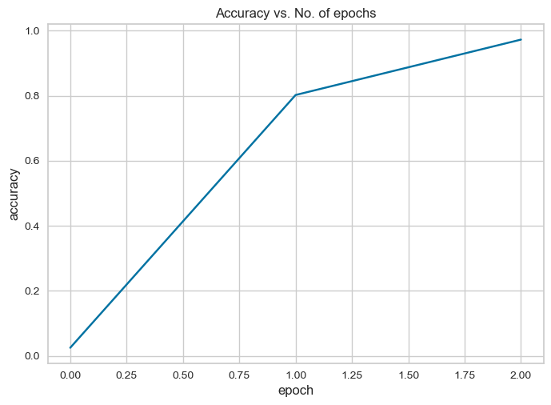

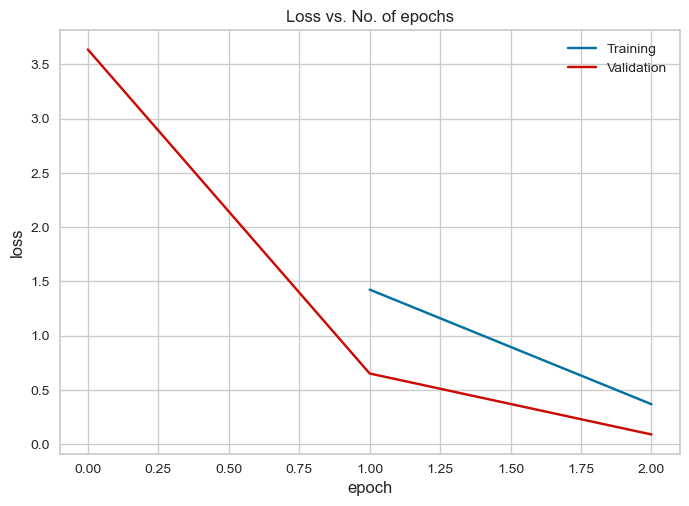

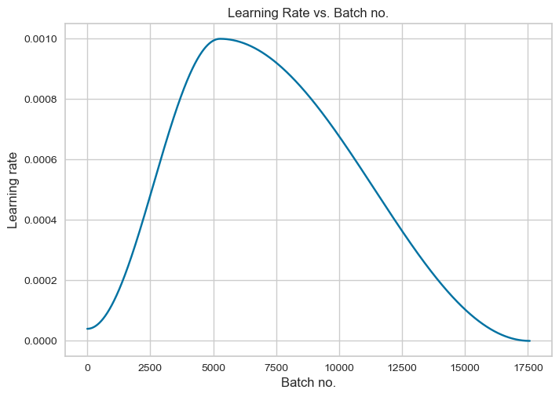

### EFFICIENT NET B0

Epoch [0], last_lr: 0.00081, train_loss: 1.4941, val_loss: 0.4674, val_acc: 0.8466
Epoch [1], last_lr: 0.00000, train_loss: 0.2192, val_loss: 0.0715, val_acc: 0.9771
CPU times: total: 54.2 s
Wall time: 11min 42s

Classification Report: 

                                                    precision    recall  f1-score   support

                                Apple___Apple_scab       0.99      0.99      0.99       504
                                 Apple___Black_rot       1.00      0.99      1.00       497
                          Apple___Cedar_apple_rust       0.98      0.98      0.98       440
                                   Apple___healthy       0.96      0.99      0.98       502
                               Blueberry___healthy       0.98      0.98      0.98       454
          Cherry_(including_sour)___Powdery_mildew       0.99      0.99      0.99       421
                 Cherry_(including_sour)___healthy       0.98      0.99      0.99       456
Corn_(maize)___Cercospora_leaf_spot Gray_leaf_spot       0.97      0.93      0.95       410
                       Corn_(maize)___Common_rust_       0.99      0.99      0.99       477
               Corn_(maize)___Northern_Leaf_Blight       0.94      0.98      0.96       477
                            Corn_(maize)___healthy       1.00      1.00      1.00       465
                                 Grape___Black_rot       0.99      0.94      0.97       472
                      Grape___Esca_(Black_Measles)       0.99      0.98      0.99       480
        Grape___Leaf_blight_(Isariopsis_Leaf_Spot)       0.95      1.00      0.97       430
                                   Grape___healthy       0.99      1.00      0.99       423
          Orange___Haunglongbing_(Citrus_greening)       0.99      1.00      0.99       503
                            Peach___Bacterial_spot       0.99      0.99      0.99       459
                                   Peach___healthy       0.98      1.00      0.99       432
                     Pepper,_bell___Bacterial_spot       0.98      0.97      0.97       478
                            Pepper,_bell___healthy       0.99      0.94      0.96       497
                             Potato___Early_blight       0.99      1.00      0.99       485
                              Potato___Late_blight       0.97      0.98      0.98       485
                                  Potato___healthy       0.99      0.98      0.98       456
                               Raspberry___healthy       0.99      0.99      0.99       445
                                 Soybean___healthy       0.98      0.98      0.98       505
                           Squash___Powdery_mildew       1.00      1.00      1.00       434
                          Strawberry___Leaf_scorch       1.00      0.99      0.99       444
                              Strawberry___healthy       0.99      1.00      1.00       456
                           Tomato___Bacterial_spot       0.96      0.96      0.96       425
                             Tomato___Early_blight       0.96      0.90      0.93       480
                              Tomato___Late_blight       0.93      0.94      0.93       463
                                Tomato___Leaf_Mold       0.98      0.99      0.99       470
                       Tomato___Septoria_leaf_spot       0.96      0.94      0.95       436
     Tomato___Spider_mites Two-spotted_spider_mite       0.92      0.98      0.95       435
                              Tomato___Target_Spot       0.95      0.89      0.92       457
            Tomato___Tomato_Yellow_Leaf_Curl_Virus       0.98      0.99      0.98       490
                      Tomato___Tomato_mosaic_virus       0.98      1.00      0.99       448
                                  Tomato___healthy       0.98      0.99      0.99       481

                                          accuracy                           0.98     17572
                                         macro avg       0.98      0.98      0.98     17572
                                      weighted avg       0.98      0.98      0.98     17572

Balanced accuracy score: 
0.9770061938826758

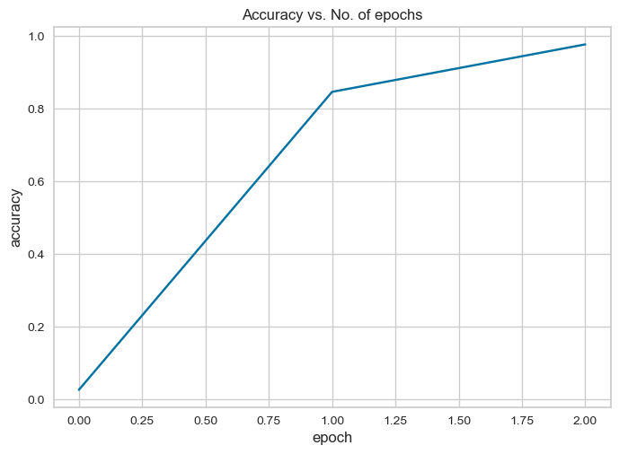

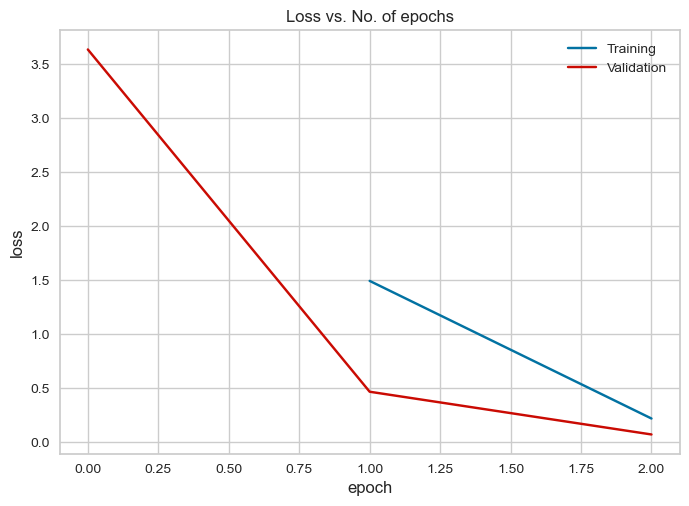

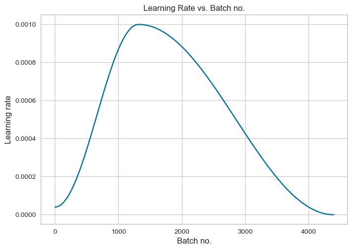

